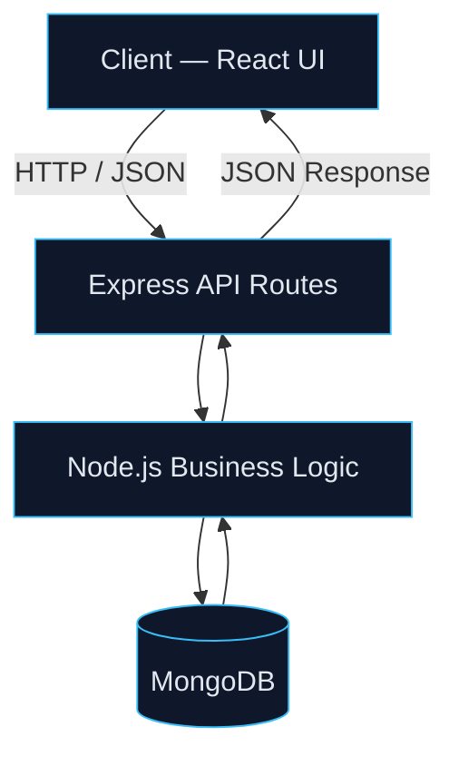
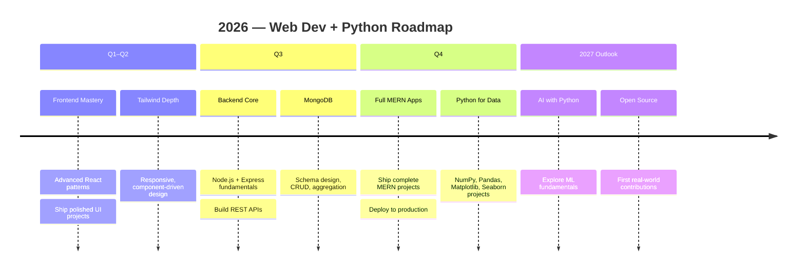
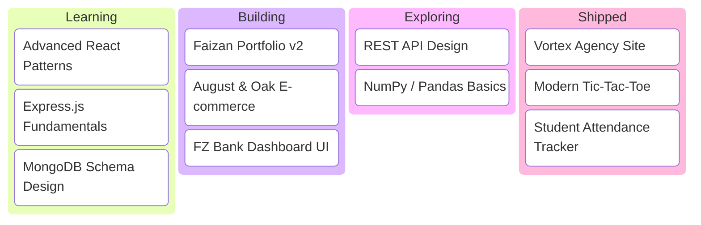
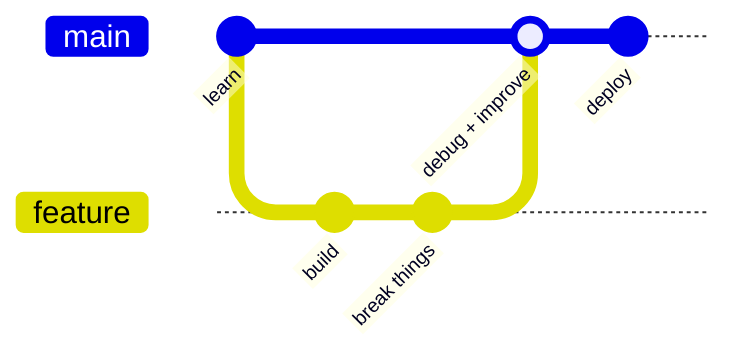
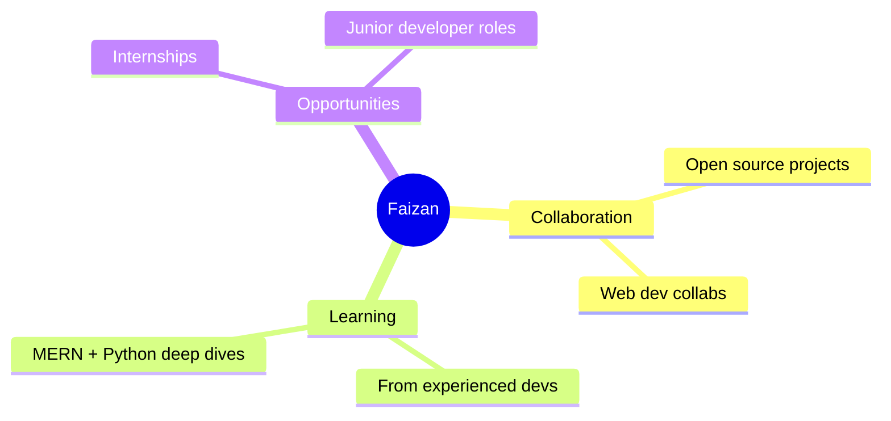

<div align="center">


<a href="https://github.com/Faizan-khan144"></a>
<a href="https://github.com/Faizan-khan144"></a>


<a href="https://www.linkedin.com/in/muhammadfaizankhan-76513041a/"></a>
<a href="https://x.com/faizan525nk"></a>
<a href="mailto:muhammadfaizankhan525@gmail.com"></a>

</div>

<br>

## 💻 whoami

```python
class MuhammadFaizanKhan:
    """Frontend Developer, transitioning into full-stack + data."""

    role        = "Frontend Developer"
    learning    = ["MERN Stack", "Python for Data & AI"]
    stack       = ["HTML", "CSS", "JavaScript", "React", "Tailwind CSS"]
    exploring   = ["Node.js", "Express", "MongoDB", "NumPy", "Pandas"]
    based_in    = "Pakistan"

    def philosophy(self) -> str:
        return "I don't just want to learn technologies — I want to build things with them."

    def __repr__(self) -> str:
        return f"<Developer role={self.role!r} status='building'>"


me = MuhammadFaizanKhan()
print(me.philosophy())
# → I don't just want to learn technologies — I want to build things with them.
```

<br>

## 🧰 Tech Stack

<div align="center">


</div>

| Category | Tools |
|---|---|
| **Frontend** | HTML5 · CSS3 · JavaScript · React · Tailwind CSS |
| **Backend (learning)** | Node.js · Express.js · REST APIs |
| **Database (learning)** | MongoDB |
| **Python & Data** | Python · NumPy · Pandas · Matplotlib · Seaborn |
| **Tools** | Git · GitHub · VS Code · Postman · Vercel |

<br>

## 🏗️ MERN Architecture — what I'm building toward



<br>

## 🧭 2026 Learning Roadmap



<br>

## 🎯 Current Focus Board



<br>

## 🔁 How I Work



<br>

## 🚀 Featured Projects

<table>
<tr>
<td width="50%">

**Faizan Portfolio**
Personal developer portfolio showcasing projects, skills, and journey.
`HTML` `CSS` `JavaScript`
[Repo](https://github.com/Faizan-khan144/faizan-portfolio) · [Live](https://faizan-khan144.github.io/faizan-portfolio/)

</td>
<td width="50%">

**August & Oak**
Modern e-commerce storefront — filtering, cart, wishlist, Local Storage.
`HTML` `CSS` `JavaScript`
[Repo](https://github.com/Faizan-khan144/august-and-oak-ecommerce)

</td>
</tr>
<tr>
<td width="50%">

**Vortex Agency**
Premium agency site — responsive sections, animation, modern UI.
`HTML` `CSS` `JavaScript`
[Repo](https://github.com/Faizan-khan144/vortex-agency)

</td>
<td width="50%">

**FZ Bank**
Banking interface with clean layouts and a dashboard experience.
`HTML` `CSS` `JavaScript`
[View](https://github.com/Faizan-khan144)

</td>
</tr>
</table>

<br>

## 📊 GitHub Analytics

<div align="center">


</div>

**Contribution snake** — add the [Platane/snk](https://github.com/Platane/snk) Action to `Faizan-khan144/Faizan-khan144` once, then this will render:

<div align="center">

</div>

<br>

## 🎯 What I'm Open To



<br>

## 🌍 Connect

<div align="center">

<a href="https://github.com/Faizan-khan144"></a>
<a href="https://www.linkedin.com/in/muhammadfaizankhan-76513041a/"></a>
<a href="https://x.com/faizan525nk"></a>
<a href="mailto:muhammadfaizankhan525@gmail.com"></a>

<br><br>


**Learn → Build → Debug → Improve → Repeat**

</div>
