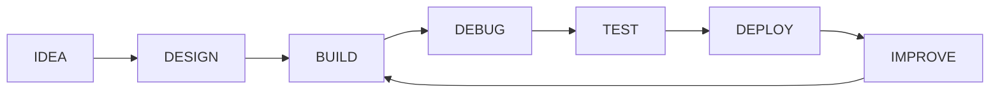

<div align="center">

# MUHAMMAD FAIZAN KHAN

### FRONTEND DEVELOPER · MERN STACK · PYTHON


<br/>


<br/><br/>

<a href="https://github.com/Faizan-khan144">

</a>

<a href="https://github.com/Faizan-khan144">

</a>


<br/><br/>

<a href="https://www.linkedin.com/in/muhammadfaizankhan-76513041/">

</a>

<a href="https://x.com/faizan525nk">

</a>

<a href="https://faizan-portfolio-kappa.vercel.app/">

</a>

<a href="mailto:muhammadfaizankhan525@gmail.com">

</a>

</div>

---

# PROFILE

```text
┌──────────────────────────────────────────────────────────────────────┐
│                         FAIZAN / PROFILE                              │
├──────────────────────────────────────────────────────────────────────┤
│                                                                      │
│  ROLE          Frontend Developer                                   │
│  SPECIALTY     Responsive interfaces and modern web experiences     │
│  PRIMARY       HTML · CSS · JavaScript · React · Tailwind            │
│  EXPANDING     Node.js · Express · MongoDB · REST APIs               │
│  EXPLORING     Python · NumPy · Pandas · Matplotlib                  │
│                                                                      │
│  CURRENT STATE                                                      │
│  Building projects, improving architecture, learning full-stack.     │
│                                                                      │
│  DEVELOPMENT PHILOSOPHY                                             │
│  Build it. Break it. Understand it. Improve it. Ship it.             │
│                                                                      │
└──────────────────────────────────────────────────────────────────────┘
```

---

# PAKISTAN CONTRIBUTION RANKINGS

<div align="center">


<br/>


<br/>


<br/><br/>

`PUBLIC COMMITS` · `ALL CONTRIBUTIONS` · `PUBLIC CONTRIBUTIONS`

</div>

---

# DEVELOPMENT STACK

<div align="center">


</div>

<br/>

| Area     | Technologies                                 |
| -------- | -------------------------------------------- |
| Frontend | HTML5, CSS3, JavaScript, React, Tailwind CSS |
| Backend  | Node.js, Express.js, REST APIs               |
| Database | MongoDB, Mongoose                            |
| Python   | Python, NumPy, Pandas, Matplotlib            |
| Tooling  | Git, GitHub, VS Code, Postman, Vercel        |

---

# CURRENTLY BUILDING

<div align="center">


</div>

### Frontend

Building cleaner component structures, responsive layouts, modern interactions, and production-style interfaces.

### Backend

Moving deeper into Node.js, Express, REST API architecture, authentication, and MongoDB.

### Python

Exploring Python through data manipulation and visualization with NumPy, Pandas, and Matplotlib.

---

# SELECTED PROJECTS

<table>
<tr>
<td width="50%" valign="top">

### AUGUST & OAK

Modern e-commerce storefront focused on clean UI and practical client-side functionality.

`HTML` `CSS` `JavaScript`

Features:

* Product filtering
* Shopping cart
* Wishlist
* Local Storage
* Responsive interface

<a href="https://github.com/Faizan-khan144/august-and-oak-ecommerce">REPOSITORY</a>

</td>

<td width="50%" valign="top">

### VORTEX AGENCY

Modern agency website designed around strong visual hierarchy, responsive layouts, and polished interactions.

`HTML` `CSS` `JavaScript`

Focus:

* Agency presentation
* Responsive design
* Modern UI
* Interactive sections

<a href="https://github.com/Faizan-khan144/vortex-agency">REPOSITORY</a>

</td>
</tr>

<tr>
<td width="50%" valign="top">

### FZ BANK

Banking dashboard concept with a clean interface and financial-product style layouts.

`HTML` `CSS` `JavaScript`

Focus:

* Dashboard UI
* Financial components
* Responsive layouts
* Interface architecture

<a href="https://github.com/Faizan-khan144">GITHUB</a>

</td>

<td width="50%" valign="top">

### FAIZAN PORTFOLIO

Personal developer portfolio showcasing projects, technical skills, and development work.

`HTML` `CSS` `JavaScript`

Focus:

* Portfolio presentation
* Responsive design
* Project showcase
* Personal branding

<a href="https://faizan-khan144.github.io/faizan-portfolio/">LIVE SITE</a>

</td>
</tr>
</table>

---

# GITHUB ACTIVITY

<div align="center">


<br/><br/>


<br/><br/>


</div>

---

# THE ROADMAP

```text
2026

FRONTEND
████████████████████████████████████  ACTIVE

REACT
██████████████████████████████████░░  ACTIVE

TAILWIND
██████████████████████████████████░░  ACTIVE

NODE.JS
██████████████████████░░░░░░░░░░░░░  BUILDING

EXPRESS
████████████████████░░░░░░░░░░░░░░░  BUILDING

MONGODB
██████████████████░░░░░░░░░░░░░░░░░  BUILDING

PYTHON
████████████████████░░░░░░░░░░░░░░░  EXPLORING

OPEN SOURCE
██████████████░░░░░░░░░░░░░░░░░░░░░  EXPANDING
```

---

# DEVELOPMENT WORKFLOW



---

# THE REAL WORKFLOW

```text
09:00    Open VS Code

09:05    Start project

09:20    "This should be easy"

10:00    CSS stops making sense

10:30    Search documentation

11:00    Fix one thing

11:15    Break three other things

12:00    Git commit

12:01    Notice the bug

12:05    New commit

12:30    Everything works

12:31    Do not touch anything

12:32    Touch everything
```

---

# WHAT I'M LOOKING FOR

<div align="center">


</div>

---

# PROFILE TELEMETRY

<div align="center">


</div>

---

# CONNECT

<div align="center">

<a href="https://github.com/Faizan-khan144">

</a>

<a href="https://www.linkedin.com/in/muhammadfaizankhan-76513041/">

</a>

<a href="https://x.com/faizan525nk">

</a>

<a href="mailto:muhammadfaizankhan525@gmail.com">

</a>

</div>

---

<div align="center">


### BUILD. DEBUG. SHIP. REPEAT.

</div>
