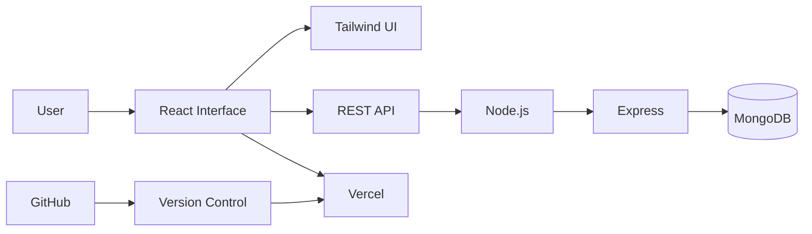
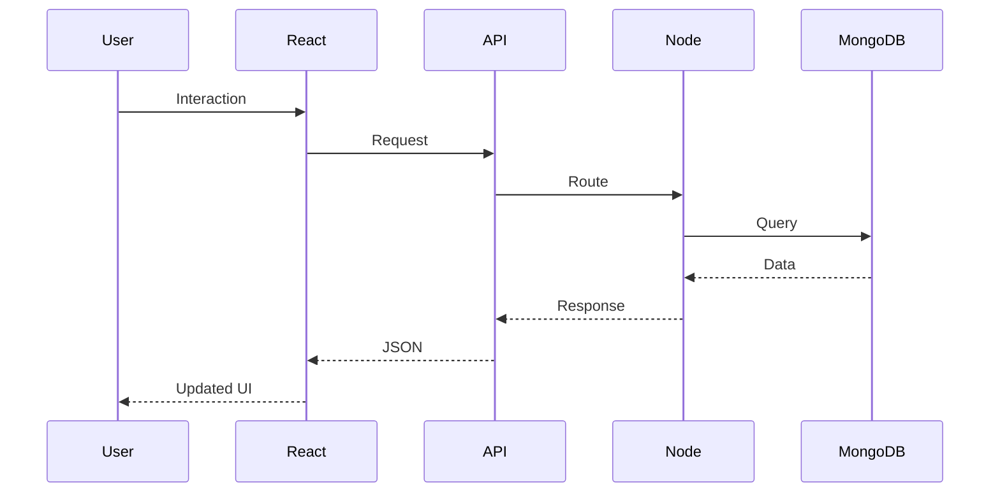

<div align="center">

# FAIZAN.DEV

### `FRONTEND ENGINEER // MERN IN PROGRESS // PROFESSIONAL BUG CREATOR`


<br>


<br><br>

<a href="https://github.com/Faizan-khan144">

</a>
&nbsp;
<a href="https://github.com/Faizan-khan144">

</a>
&nbsp;


<br><br>

<a href="https://www.linkedin.com/in/muhammadfaizankhan-76513041/">

</a>
&nbsp;
<a href="https://x.com/faizan525nk">

</a>
&nbsp;
<a href="mailto:muhammadfaizankhan525@gmail.com">

</a>

<br><br>


&nbsp;

&nbsp;


</div>

---

# SYSTEM BOOT

```text
┌──────────────────────────────────────────────────────────────────────────────┐
│                         FAIZAN.DEV SYSTEM MONITOR                            │
├──────────────────────────────────────────────────────────────────────────────┤
│                                                                              │
│  USER       : Faizan Khan                                                   │
│  ROLE       : Frontend Developer                                            │
│  LOCATION   : Pakistan                                                      │
│  STACK      : JavaScript / React / Tailwind / Node / MongoDB                │
│  MODE       : BUILDING                                                      │
│  STATUS     : ONLINE                                                        │
│                                                                              │
│  FRONTEND   [████████████████████████████████]  ACTIVE                      │
│  REACT      [██████████████████████████████░░]  ACTIVE                      │
│  BACKEND    [██████████████████░░░░░░░░░░░░░]  COMPILING                   │
│  DATABASE   [██████████████░░░░░░░░░░░░░░░░]  LEARNING                    │
│  PYTHON     [████████████████░░░░░░░░░░░░░░]  EXPLORING                   │
│                                                                              │
└──────────────────────────────────────────────────────────────────────────────┘
```

---

# THE BOT DEPARTMENT

```text
╔══════════════════════════════════════════════════════════════════════════════╗
║                           FAIZAN BOT NETWORK                                ║
╠══════════════════════════════════════════════════════════════════════════════╣
║                                                                              ║
║  [BOT_001] FRONTEND_BOT                                                      ║
║  Mission : Turn designs into interfaces                                     ║
║  Status  : ACTIVE                                                            ║
║  Favorite command : npm run build                                            ║
║                                                                              ║
║  [BOT_002] BUG_BOT                                                           ║
║  Mission : Appear exactly 4 minutes before deployment                        ║
║  Status  : ALWAYS ONLINE                                                     ║
║  Favorite command : "Why is this undefined?"                                ║
║                                                                              ║
║  [BOT_003] MERN_BOT                                                          ║
║  Mission : Become full-stack                                                 ║
║  Status  : COMPILING                                                         ║
║  Favorite command : npm install                                              ║
║                                                                              ║
║  [BOT_004] DEBUG_BOT                                                         ║
║  Mission : Fix bugs created by BOT_001                                      ║
║  Status  : OVERWORKED                                                        ║
║  Favorite command : console.log()                                           ║
║                                                                              ║
║  [BOT_005] DEPLOYMENT_BOT                                                    ║
║  Mission : Push everything to production                                    ║
║  Status  : "IT WORKS ON MY MACHINE"                                         ║
║                                                                              ║
╚══════════════════════════════════════════════════════════════════════════════╝
```

---

# ABOUT THE OPERATOR

```javascript
const faizan = {
    role: "Frontend Developer",
    currentlyBuilding: [
        "Responsive Interfaces",
        "React Applications",
        "MERN Projects",
        "Real-World Web Experiences"
    ],

    frontend: [
        "HTML5",
        "CSS3",
        "JavaScript",
        "React",
        "Tailwind CSS"
    ],

    backend: [
        "Node.js",
        "Express.js",
        "REST APIs"
    ],

    database: [
        "MongoDB",
        "Mongoose"
    ],

    python: [
        "Python",
        "NumPy",
        "Pandas",
        "Matplotlib",
        "Seaborn"
    ],

    philosophy:
        "Build it. Break it. Debug it. Improve it. Ship it.",

    currentStatus:
        "Turning caffeine into interfaces."
};
```

---

# DEVELOPER TERMINAL

```text
faizan@dev-machine:~$ whoami

Frontend Developer

faizan@dev-machine:~$ cat /etc/motivation

Build something useful.

faizan@dev-machine:~$ git status

On branch main
Your branch is ahead of procrastination.

nothing to commit,
everything to improve.

faizan@dev-machine:~$ npm run life

> life@2026 start

Compiling skills...
Learning backend...
Building projects...
Breaking CSS...
Fixing CSS...
Deploying...

Build successful.

faizan@dev-machine:~$ _
```

---

# PAKISTAN GITHUB RANKINGS

<div align="center">

### PUBLIC COMMITS


### ALL CONTRIBUTIONS


### PUBLIC CONTRIBUTIONS


</div>

---

# TECH ARSENAL

<div align="center">

### FRONTEND


### BACKEND


### DATABASE


### PYTHON & DATA


### TOOLING


</div>

---

# CURRENT MISSION

```text
MISSION 01
████████████████████████████████████████
Master modern frontend development

MISSION 02
████████████████████████████░░░░░░░░░░
Build complete MERN applications

MISSION 03
██████████████████████░░░░░░░░░░░░░░░░
Improve backend architecture

MISSION 04
██████████████████░░░░░░░░░░░░░░░░░░░░
Build useful open-source projects

MISSION 05
██████████████░░░░░░░░░░░░░░░░░░░░░░░░
Explore Python and data workflows
```

---

# PROJECT CONTROL CENTER

<table align="center">
<tr>
<td width="50%" valign="top">

### AUGUST & OAK

Modern e-commerce experience with filtering, cart, wishlist and local storage.

`HTML` `CSS` `JavaScript`

<a href="https://github.com/Faizan-khan144/august-and-oak-ecommerce">SOURCE</a>

</td>

<td width="50%" valign="top">

### VORTEX AGENCY

Modern agency interface focused on responsive layouts, animation and polished UI.

`HTML` `CSS` `JavaScript`

<a href="https://github.com/Faizan-khan144/vortex-agency">SOURCE</a>

</td>
</tr>

<tr>
<td width="50%" valign="top">

### FZ BANK

Modern banking dashboard concept with clean layouts and interactive interface patterns.

`HTML` `CSS` `JavaScript`

<a href="https://github.com/Faizan-khan144">SOURCE</a>

</td>

<td width="50%" valign="top">

### FAIZAN PORTFOLIO

Personal developer portfolio showcasing projects, experiments and technical growth.

`HTML` `CSS` `JavaScript`

<a href="https://github.com/Faizan-khan144/faizan-portfolio">SOURCE</a>

</td>
</tr>
</table>

---

# GITHUB TELEMETRY

<div align="center">


<br><br>


<br><br>


</div>

---

# ACHIEVEMENT SERVER

<div align="center">


</div>

---

# DEVELOPMENT LOG

```text
[2026.01]  Frontend systems improved
[2026.02]  React projects expanded
[2026.03]  Tailwind workflows improved
[2026.04]  JavaScript architecture refined
[2026.05]  MERN stack entered the pipeline
[2026.06]  Backend development activated
[2026.07]  Portfolio systems upgraded
[2026.08]  GitHub profile upgraded
[2026.09]  More projects loading...
```

---

# BUG REPORT

```text
╭──────────────────────────────────────────────────────────────╮
│ BUG REPORT #404                                               │
├──────────────────────────────────────────────────────────────┤
│                                                              │
│ Description:                                                 │
│ Developer keeps adding new technologies to the stack.       │
│                                                              │
│ Expected:                                                     │
│ Stop learning.                                                │
│                                                              │
│ Actual:                                                       │
│ "Wait, I should learn this too."                             │
│                                                              │
│ Severity: HIGH                                                │
│                                                              │
│ Resolution:                                                   │
│ Not a bug. It's a feature.                                    │
│                                                              │
╰──────────────────────────────────────────────────────────────╯
```

---

# SYSTEM ARCHITECTURE



---

# REQUEST LIFECYCLE



---

# CONTRIBUTION ENGINE

<div align="center">


</div>

---

# WHAT I BUILD

```text
                 FAIZAN DEVELOPMENT LOOP

                       ┌───────────┐
                       │   IDEA    │
                       └─────┬─────┘
                             │
                             ▼
                       ┌───────────┐
                       │  DESIGN   │
                       └─────┬─────┘
                             │
                             ▼
                       ┌───────────┐
                       │   CODE    │
                       └─────┬─────┘
                             │
                             ▼
                       ┌───────────┐
                       │   BUGS    │
                       └─────┬─────┘
                             │
                             ▼
                       ┌───────────┐
                       │  DEBUG    │
                       └─────┬─────┘
                             │
                             ▼
                       ┌───────────┐
                       │   SHIP    │
                       └─────┬─────┘
                             │
                             ▼
                       ┌───────────┐
                       │ IMPROVE   │
                       └─────┬─────┘
                             │
                             └───────────────► REPEAT
```

---

# CURRENTLY AVAILABLE

<div align="center">


</div>

---

# CONNECT TO THE SYSTEM

<div align="center">

<a href="https://github.com/Faizan-khan144">

</a>

<a href="https://www.linkedin.com/in/muhammadfaizankhan-76513041/">

</a>

<a href="https://x.com/faizan525nk">

</a>

<a href="mailto:muhammadfaizankhan525@gmail.com">

</a>

<br><br>

```text
╔══════════════════════════════════════════════════════════════╗
║                                                              ║
║                     SYSTEM MESSAGE                           ║
║                                                              ║
║          Learn → Build → Break → Debug → Ship                ║
║                                                              ║
║                    LOOP NEVER ENDS                           ║
║                                                              ║
╚══════════════════════════════════════════════════════════════╝
```


</div>
