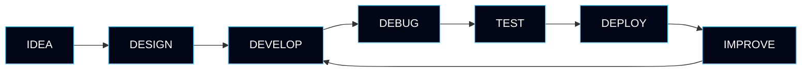
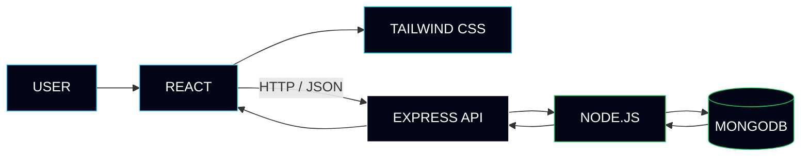
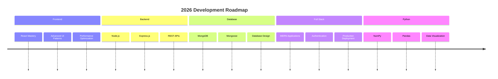

<div align="center">


<br/>


<br/><br/>

<a href="https://github.com/Faizan-khan144">

</a>

<a href="https://www.linkedin.com/in/muhammadfaizankhan-76513041/">

</a>

<a href="https://x.com/faizan525nk">

</a>

<a href="mailto:muhammadfaizankhan525@gmail.com">

</a>

<br/><br/>


<br/><br/>

<h2>🇵🇰 GitHub Rankings — Pakistan</h2>

<table>
<tr>
<td align="center">

<b>PUBLIC COMMITS</b>

<br/><br/>


</td>

<td align="center">

<b>ALL CONTRIBUTIONS</b>

<br/><br/>


</td>

<td align="center">

<b>PUBLIC CONTRIBUTIONS</b>

<br/><br/>


</td>
</tr>
</table>

<br/>


<br/><br/>


<br/>


<br/><br/>

<sub>DESIGN • DEVELOP • DEPLOY • IMPROVE</sub>

</div>

---

# About Me

```python
class Developer:

    name = "Muhammad Faizan Khan"
    role = "Frontend Developer"
    location = "Karachi, Pakistan"

    core_stack = [
        "HTML5",
        "CSS3",
        "JavaScript",
        "React",
        "Tailwind CSS"
    ]

    currently_learning = [
        "Node.js",
        "Express.js",
        "MongoDB",
        "MERN Architecture"
    ]

    exploring = [
        "Python",
        "NumPy",
        "Pandas",
        "Matplotlib",
        "Seaborn"
    ]

    focus = [
        "Responsive Interfaces",
        "Modern UI",
        "Performance",
        "Clean Architecture"
    ]

    philosophy = "Build. Break. Debug. Improve. Ship."

developer = Developer()
```

---

# Developer Profile

<table>
<tr>
<td width="50%">

### Frontend

Building responsive interfaces with a focus on clean layouts, reusable components, smooth interactions, and modern UI patterns.

**Core**


</td>

<td width="50%">

### Full Stack

Expanding from frontend development into complete MERN applications and backend architecture.

**Learning**


</td>
</tr>
</table>

---

# Tech Stack

<div align="center">

### Frontend Engineering


<br/><br/>

### Backend & Database


<br/><br/>

### Python & Data


<br/><br/>

### Development Tools


</div>

---

# Engineering Workflow



---

# MERN Architecture



---

# GitHub Analytics

<div align="center">


<br/><br/>


<br/><br/>


</div>

---

# GitHub Achievements

<div align="center">


</div>

---

# Featured Projects

<table>
<tr>

<td width="50%">

## August & Oak

Modern e-commerce storefront featuring product filtering, cart functionality, wishlist support, and Local Storage.

**Stack**

`HTML` `CSS` `JavaScript`

<a href="https://github.com/Faizan-khan144/august-and-oak-ecommerce">

</a>

</td>

<td width="50%">

## Vortex Agency

Modern agency website focused on premium layouts, responsive design, animations, and polished user experience.

**Stack**

`HTML` `CSS` `JavaScript`

<a href="https://github.com/Faizan-khan144/vortex-agency">

</a>

</td>

</tr>

<tr>

<td width="50%">

## Faizan Portfolio

Personal portfolio showcasing projects, technical skills, experience, and development journey.

**Stack**

`HTML` `CSS` `JavaScript`

<a href="https://github.com/Faizan-khan144/faizan-portfolio">

</a>

</td>

<td width="50%">

## FZ Bank

Modern banking interface with dashboard-focused layouts and clean financial UI patterns.

**Stack**

`HTML` `CSS` `JavaScript`

<a href="https://github.com/Faizan-khan144">

</a>

</td>

</tr>
</table>

---

# Current Focus

```text
┌─────────────────────────────────────────────────────────────┐
│                     CURRENT DEVELOPMENT                     │
├─────────────────────────────────────────────────────────────┤
│                                                             │
│  ████████████████████░░░░  React & Frontend                │
│  ███████████████░░░░░░░░░  JavaScript                     │
│  ████████████░░░░░░░░░░░░  Tailwind CSS                   │
│  ██████████░░░░░░░░░░░░░░  Node.js                        │
│  ████████░░░░░░░░░░░░░░░░  Express.js                     │
│  ██████░░░░░░░░░░░░░░░░░░  MongoDB                       │
│  ███████░░░░░░░░░░░░░░░░░  Python                         │
│                                                             │
└─────────────────────────────────────────────────────────────┘
```

---

# 2026 Roadmap



---

# Problem Solving

<div align="center">


</div>

---

# Experience

### Frontend Developer — Freelance / Self-Directed Projects

**2024 — Present**

Building responsive, production-style web interfaces using HTML, CSS, JavaScript, React, and Tailwind CSS.

Focused on:

* Responsive UI development
* Component-based architecture
* Modern frontend patterns
* Client-side state management
* API integration
* Performance optimization
* Cross-browser compatibility
* Clean and maintainable code

Currently expanding into backend development with Node.js, Express, MongoDB, and the MERN stack.

---

# Contribution Graph

<div align="center">


<br/><br/>


</div>

---

# Connect With Me

<div align="center">

<a href="https://github.com/Faizan-khan144">

</a>

<a href="https://www.linkedin.com/in/muhammadfaizankhan-76513041/">

</a>

<a href="https://x.com/faizan525nk">

</a>

<a href="mailto:muhammadfaizankhan525@gmail.com">

</a>

<br/><br/>


### `BUILD → SHIP → LEARN → REPEAT`

</div>
