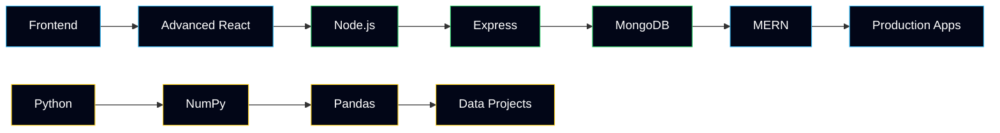

<div align="center">


<br/>

# `muhammad@faizan:~$ whoami`


<br/>

> **I build interfaces that look intentional.**
> Currently turning `console.log("why isn't this working")` into actual products.

<br/>


<br/><br/>

<a href="https://github.com/Faizan-khan144">

</a>
<a href="https://github.com/Faizan-khan144">

</a>


<br/><br/>

<a href="https://www.linkedin.com/in/muhammadfaizankhan-76513041/">

</a>
<a href="https://x.com/faizan525nk">

</a>
<a href="mailto:muhammadfaizankhan525@gmail.com">

</a>

<br/><br/><br/>

<table>
<tr>
<td align="center" width="33%">

### 🇵🇰 PAKISTAN


<sub>Public Commits Rank</sub>

</td>

<td align="center" width="33%">

### 🔥 CONTRIBUTIONS


<sub>Public Contributions Rank</sub>

</td>

<td align="center" width="33%">

### 🔒 ALL ACTIVITY


<sub>All Contributions Rank</sub>

</td>
</tr>
</table>

<br/>


<br/><br/>

```text
╭──────────────────────────────────────────────────────────────────────╮
│                                                                      │
│   $ git status                                                       │
│                                                                      │
│   ● frontend        building                                        │
│   ● react           shipping                                        │
│   ● javascript      fighting bugs                                   │
│   ● mern            loading...                                      │
│   ● python          exploring                                       │
│                                                                      │
│   Current mission:                                                   │
│   Build something useful enough that someone actually wants to use it│
│                                                                      │
╰──────────────────────────────────────────────────────────────────────╯
```

<br/>


<br/><br/>

<sub>

`HTML` · `CSS` · `JavaScript` · `React` · `Tailwind` · `Node.js` · `Express` · `MongoDB` · `Python`

</sub>

<br/><br/>


</div>

---

## About Me

I'm Muhammad Faizan Khan — a frontend developer who enjoys turning ideas into polished, responsive interfaces.

I spend most of my time with **JavaScript, React, Tailwind CSS, and modern frontend development**, while gradually expanding into the **MERN stack**.

When I'm not fighting CSS, I'm usually:

* Building something that started as "just a small project"
* Turning designs into responsive interfaces
* Learning backend development
* Exploring Python and data tools
* Breaking something perfectly functional and then fixing it
* Looking for better ways to write cleaner code

### Current Status

```text
Frontend        ████████████████████░░  90%
React           █████████████████░░░░░  80%
JavaScript      ██████████████████░░░░  85%
Tailwind CSS    ███████████████████░░░  90%
Node.js         ███████████░░░░░░░░░░░  Learning
Express.js      █████████░░░░░░░░░░░░░  Learning
MongoDB         ████████░░░░░░░░░░░░░░  Learning
Python          ██████████░░░░░░░░░░░░  Exploring
```

> **Current objective:** Become dangerously good at building things for the web.

---

## The Developer Behind The Commits

```python
developer = {
    "name": "Muhammad Faizan Khan",
    "role": "Frontend Developer",
    "location": "Pakistan",

    "main_weapon": "JavaScript",
    "favorite_framework": "React",
    "styling_weapon": "Tailwind CSS",

    "currently_learning": [
        "Node.js",
        "Express.js",
        "MongoDB"
    ],

    "currently_exploring": [
        "Python",
        "NumPy",
        "Pandas",
        "Data Visualization"
    ],

    "debugging_strategy": [
        "Read error",
        "Pretend I understand",
        "Google it",
        "Fix it",
        "Never touch that line again"
    ],

    "life_cycle": "Build → Break → Debug → Learn → Repeat"
}
```

---

## Tech Stack

<div align="center">


</div>

---

## GitHub Analytics

<div align="center">


<br/><br/>


</div>

---

## Things I'm Building

<table>
<tr>

<td width="50%">

### August & Oak

A modern e-commerce experience with filtering, cart functionality, wishlist support, and persistent client-side state.

`HTML` `CSS` `JavaScript`

</td>

<td width="50%">

### Vortex Agency

A premium agency-style website focused on responsive layouts, visual hierarchy, animation, and modern UI.

`HTML` `CSS` `JavaScript`

</td>

</tr>

<tr>

<td width="50%">

### Faizan Portfolio

My personal developer portfolio for showcasing projects, skills, experiments, and the journey behind them.

`HTML` `CSS` `JavaScript`

</td>

<td width="50%">

### FZ Bank

A modern banking interface focused on dashboard layouts, clean information architecture, and polished UI.

`HTML` `CSS` `JavaScript`

</td>

</tr>
</table>

---

## Development Philosophy

```text
GOOD CODE
    ↓
Readable
    ↓
Maintainable
    ↓
Useful
    ↓
Fast
    ↓
Shipped
```

I don't want to just collect technologies.

I want to **build real things with them**.

---

## 2026 Mission



---

<div align="center">

### `$ git commit -m "keep building"`

<br/>


`Learn → Build → Debug → Improve → Repeat`

</div>
