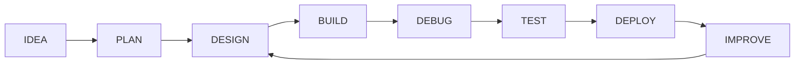

<div align="center">

# Hi , I'm Muhammad Faizan Khan

### Frontend Developer · MERN Stack Developer · Python Learner

<p>
Building responsive, modern, and practical web experiences with a focus on clean interfaces and real-world projects.
</p>

<a href="https://github.com/Faizan-khan144">
  
</a>
<a href="https://github.com/Faizan-khan144">
  
</a>

<br/><br/>


<br/>

<a href="https://www.linkedin.com/in/muhammadfaizankhan-76513041/">
  
</a>
<a href="https://x.com/faizan525nk">
  
</a>
<a href="https://faizan-portfolio-kappa.vercel.app/">
  
</a>

</div>

---

# ABOUT ME

I'm **Muhammad Faizan Khan**, a developer focused on creating modern web interfaces and continuously expanding toward full-stack development.

My primary strength is frontend development. I enjoy taking an idea from a blank screen to a responsive, functional experience with attention to structure, usability, and detail.

I work with JavaScript-based technologies and am currently developing deeper knowledge of the MERN stack while also exploring Python and its ecosystem.

```text
ROLE              Frontend Developer

PRIMARY FOCUS     Responsive Web Development
                  Modern User Interfaces
                  JavaScript Applications

CORE STACK        HTML · CSS · JavaScript
                  React · Tailwind CSS

EXPANDING INTO    Node.js · Express.js
                  MongoDB · REST APIs

EXPLORING         Python · NumPy · Pandas
                  Matplotlib

APPROACH          Build → Test → Debug → Improve → Ship
```

---

# WHAT I DO

## Frontend Development

I build responsive interfaces designed to work across different screen sizes while maintaining clean layouts and practical user experiences.

My work includes:

* Responsive websites
* Modern landing pages
* Interactive JavaScript applications
* React-based interfaces
* Dashboard concepts
* E-commerce experiences
* Portfolio websites
* UI-focused web projects

## Full-Stack Development

I'm expanding beyond the frontend and building toward complete web applications.

Current areas of development:

* Node.js
* Express.js
* REST APIs
* MongoDB
* Mongoose
* Client-server architecture

## Python

I'm also exploring Python for programming, data manipulation, and visualization.

Current tools:

* Python
* NumPy
* Pandas
* Matplotlib

---

# DEVELOPMENT STACK

<div align="center">


</div>

<br/>

| CATEGORY | TECHNOLOGIES                                     |
| -------- | ------------------------------------------------ |
| FRONTEND | HTML5 · CSS3 · JavaScript · React · Tailwind CSS |
| BACKEND  | Node.js · Express.js · REST APIs                 |
| DATABASE | MongoDB · Mongoose                               |
| PYTHON   | Python · NumPy · Pandas · Matplotlib             |
| TOOLS    | Git · GitHub · VS Code · Postman · Vercel        |

---

# CURRENTLY WORKING ON

<div align="center">


</div>

```text
01  Building more production-style frontend projects

02  Improving React component architecture and state management

03  Expanding into backend development with Node.js and Express

04  Learning how APIs connect frontend and backend applications

05  Exploring MongoDB for database-driven applications

06  Developing Python skills through practical exercises

07  Improving project quality, structure, and deployment workflows
```

---

# FEATURED PROJECTS

## AUGUST & OAK

A modern e-commerce storefront focused on clean design and practical client-side functionality.

**TECHNOLOGIES**

`HTML` `CSS` `JavaScript`

**FEATURES**

* Product filtering
* Shopping cart functionality
* Wishlist system
* Local Storage
* Responsive layouts
* Modern user interface

<a href="https://github.com/Faizan-khan144/august-and-oak-ecommerce">

</a>

---

## VORTEX AGENCY

A modern agency website designed around strong visual hierarchy, responsive layouts, and polished interactions.

**TECHNOLOGIES**

`HTML` `CSS` `JavaScript`

**FOCUS**

* Agency presentation
* Modern UI
* Responsive design
* Interactive sections
* Clean layout structure

<a href="https://github.com/Faizan-khan144/vortex-agency">

</a>

---

## FZ BANK

A modern banking interface concept featuring dashboard-style layouts and financial product components.

**TECHNOLOGIES**

`HTML` `CSS` `JavaScript`

**FOCUS**

* Dashboard interface
* Financial UI components
* Responsive layouts
* Modern interface architecture

<a href="https://github.com/Faizan-khan144">

</a>

---

## FAIZAN PORTFOLIO

My personal portfolio showcasing my projects, skills, and development work.

**TECHNOLOGIES**

`HTML` `CSS` `JavaScript`

**FOCUS**

* Project presentation
* Responsive design
* Personal branding
* Modern interface design

<a href="https://faizan-portfolio-kappa.vercel.app/">

</a>

---

# GITHUB CONTRIBUTION RANKINGS

<div align="center">


<br/><br/>


<br/><br/>


</div>

---

# GITHUB ACTIVITY

<div align="center">


<br/><br/>


<br/><br/>


</div>

---

# TOP LANGUAGES

<div align="center">


</div>

---

# GITHUB TROPHIES

<div align="center">


</div>

---

# DEVELOPMENT ROADMAP

```text
FRONTEND DEVELOPMENT

HTML / CSS
████████████████████████████████████████  ACTIVE

JAVASCRIPT
██████████████████████████████████████░░  ACTIVE

REACT
████████████████████████████████████░░░░  DEVELOPING

TAILWIND CSS
████████████████████████████████████░░░░  DEVELOPING


FULL-STACK DEVELOPMENT

NODE.JS
████████████████████████░░░░░░░░░░░░░░░░  BUILDING

EXPRESS.JS
██████████████████████░░░░░░░░░░░░░░░░░░  BUILDING

MONGODB
████████████████████░░░░░░░░░░░░░░░░░░░░  BUILDING


PYTHON

PYTHON
████████████████████████░░░░░░░░░░░░░░░░  EXPLORING

DATA LIBRARIES
████████████████████░░░░░░░░░░░░░░░░░░░░  EXPLORING
```

---

# MY DEVELOPMENT WORKFLOW



---

# THE REAL DEVELOPMENT PROCESS

```text
Start Project
     │
     ▼
Everything Looks Easy
     │
     ▼
Write Some Code
     │
     ▼
Unexpected Error
     │
     ▼
Read Documentation
     │
     ▼
Fix The Problem
     │
     ▼
Create A New Problem
     │
     ▼
Debug Again
     │
     ▼
Git Commit
     │
     ▼
Ship It
```

---

# RANDOM DEV QUOTE

<div align="center">


</div>

---

# CONNECT

<div align="center">

<a href="https://github.com/Faizan-khan144">

</a>

<a href="https://www.linkedin.com/in/muhammadfaizankhan-76513041/">

</a>

<a href="https://x.com/faizan525nk">

</a>

<a href="https://faizan-portfolio-kappa.vercel.app/">

</a>

<a href="mailto:muhammadfaizankhan525@gmail.com">

</a>

</div>

---

<div align="center">


### BUILD WITH CURIOSITY · DEBUG WITH PATIENCE · SHIP WITH CONFIDENCE

</div>
