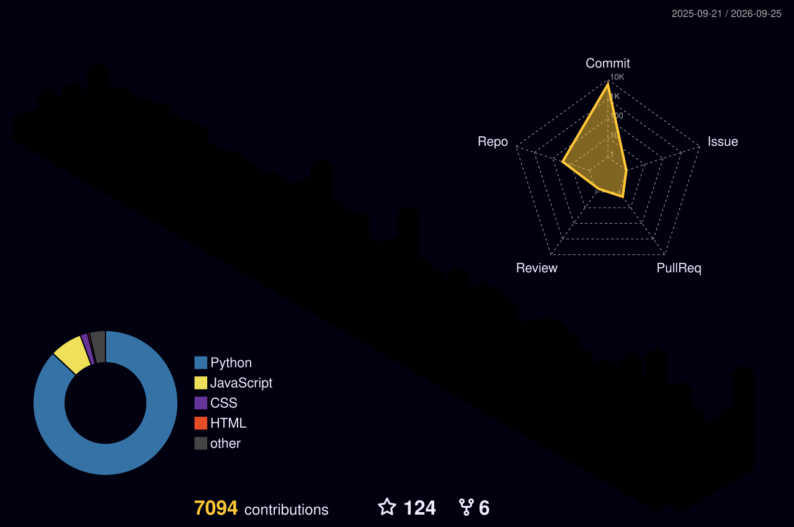

<div align="center">

# Muhammad Faizan Khan

### Frontend Developer · React Developer · MERN Stack Learner

**I build modern interfaces, solve real problems, and turn ideas into working products.**

<br>

<a href="https://faizan-portfolio-kappa.vercel.app/">

</a>
<a href="https://www.linkedin.com/in/muhammad-faizan-khan-76513041a/">

</a>
<br/>


</div>

---

<div align="center">


</div>

---

# 👋 About Me

I'm **Muhammad Faizan Khan**, a frontend developer focused on building **responsive, modern and user-focused web experiences**.

My core stack includes **JavaScript, React, HTML, CSS and Tailwind CSS**, while I'm expanding into full-stack development through **Node.js, Express.js and MongoDB**.

I enjoy the complete development cycle:

```text
Idea
  ↓
Design
  ↓
Development
  ↓
Debugging
  ↓
Testing
  ↓
Deployment
  ↓
Improvement
```

I learn primarily by **building real projects**, experimenting with new technologies and solving practical development problems.

I'm also exploring **Python, NumPy, Pandas and Matplotlib** as part of my journey into Python and AI.

---

# ⚡ What I Build

<div align="center">

<table width="100%">
<tr>

<td width="25%" align="center">

### UI

Modern interfaces
Responsive layouts
Interactive experiences

</td>

<td width="25%" align="center">

### Web Apps

React applications
Dashboards
Developer tools

</td>

<td width="25%" align="center">

### Full Stack

REST APIs
Node.js
MongoDB

</td>

<td width="25%" align="center">

### Experiments

Python
Data tools
New technologies

</td>

</tr>
</table>

</div>

---

# 🧠 Engineering Focus

<table width="100%">
<tr>

<td width="33%" valign="top">

## Frontend

* HTML5
* CSS3
* JavaScript
* React
* Tailwind CSS
* Bootstrap
* Responsive Design
* Component Architecture
* API Integration

</td>

<td width="33%" valign="top">

## Full Stack

* Node.js
* Express.js
* MongoDB
* REST APIs
* Firebase
* Vite
* Authentication
* CRUD Applications

</td>

<td width="33%" valign="top">

## Workflow

* Git
* GitHub
* VS Code
* Postman
* Figma
* Vercel
* GitHub Pages
* Deployment

</td>

</tr>
</table>

---

# 🛠️ Tech Stack

<div align="center">


</div>

---

# 🚀 Featured Projects

<div align="center">

### Selected projects built while learning, experimenting and solving real problems.

</div>

<br>

<table width="100%">

<tr>

<td width="50%" valign="top">

## 🧰 DevDock

### Developer Productivity Workspace

A collection of practical developer utilities brought together into one clean workspace.

**Includes**

* JSON tools
* Base64 utilities
* UUID generator
* Regex tester
* Color utilities
* Code snippets
* Focus timer
* Developer utilities

`React` `Vite` `JavaScript`

<br>

<a href="https://faizan-khan144.github.io/devdock/">
<b>Live Demo →</b>
</a>

  ·  

<a href="https://github.com/Faizan-khan144/devdock">
<b>Source →</b>
</a>

</td>

<td width="50%" valign="top">

## 🛍️ August & Oak

### E-Commerce Experience

A modern storefront focused on product discovery and a smooth shopping experience.

**Includes**

* Product categories
* Filtering
* Shopping cart
* Wishlist
* Local storage
* Responsive interface

`HTML` `CSS` `JavaScript`

<br>

<a href="https://github.com/Faizan-khan144/august-and-oak-ecommerce">
<b>Source →</b>
</a>

</td>

</tr>

<tr>

<td width="50%" valign="top">

## ⚡ Vortex Agency

### Digital Agency Website

A modern agency interface focused on visual hierarchy, responsive layouts and polished interactions.

`HTML` `CSS` `JavaScript`

<br>

<a href="https://github.com/Faizan-khan144/vortex-agency">
<b>Source →</b>
</a>

</td>

<td width="50%" valign="top">

## 🏦 FZ Bank

### Banking Dashboard

A banking dashboard concept exploring structured financial information, account interfaces and application-style layouts.

`HTML` `CSS` `JavaScript`

<br>

<a href="https://github.com/Faizan-khan144">
<b>Explore GitHub →</b>
</a>

</td>

</tr>

</table>

---

# 📦 More Projects

<div align="center">

| Project                        | Description                       | Stack                   |
| :----------------------------- | :-------------------------------- | :---------------------- |
| **CryptoLens**                 | Cryptocurrency dashboard          | React · JavaScript      |
| **Nexus**                      | Modern landing page               | HTML · CSS · JavaScript |
| **Student Attendance Tracker** | Attendance management application | JavaScript              |
| **Modern Rock Paper Scissors** | Interactive browser game          | JavaScript              |

<br>

<a href="https://github.com/Faizan-khan144?tab=repositories">


</a>

</div>

---

# 📊 GitHub Activity

<div align="center">


<br><br>


</div>

---

# 📈 Contribution Activity

<div align="center">


</div>

---

# 🏆 GitHub Leaderboard

<div align="center">

### Pakistan Developer Rankings

<br>

<table>
<tr>

<td align="center" width="33%">

### Public Commits

<br>

<a href="https://committers.top/pakistan/Faizan-khan144.html">

</a>

</td>

<td align="center" width="33%">

### All Contributions

<br>

<a href="https://committers.top/pakistan/Faizan-khan144.html">

</a>

</td>

<td align="center" width="33%">

### Public Contributions

<br>

<a href="https://committers.top/pakistan/Faizan-khan144.html">

</a>

</td>

</tr>
</table>

<br>

<a href="https://committers.top/pakistan/Faizan-khan144.html">


</a>

</div>

---

# 🐍 Contribution Snake

<div align="center">

<picture>

<source media="(prefers-color-scheme: dark)" srcset="dist/github-contribution-grid-snake-dark.svg">

<source media="(prefers-color-scheme: light)" srcset="dist/github-contribution-grid-snake.svg">


</picture>

</div>

---

# 🧊 3D Contribution Graph

<div align="center">



<br>

<sub>Contribution history visualized in 3D.</sub>

</div>

---

# 🧭 Development Roadmap

<div align="center">

```text
                 FRONTEND
                    │
          ┌─────────┴─────────┐
          ▼                   ▼
       React              UI / UX
          │                   │
          └─────────┬─────────┘
                    ▼
                FULL STACK
                    │
          ┌─────────┼─────────┐
          ▼         ▼         ▼
       Node.js   Express    MongoDB
          │         │         │
          └─────────┼─────────┘
                    ▼
                 MERN
                    │
                    ▼
              PYTHON + AI
                    │
                    ▼
             REAL PRODUCTS
```

</div>

---

# 📚 Currently Learning

### React

* Component architecture
* Reusable UI
* State management
* API integration
* Application structure
* Modern React patterns

### MERN

* Node.js
* Express.js
* MongoDB
* REST APIs
* Backend fundamentals
* Full-stack applications

### Python & Data

* Python
* NumPy
* Pandas
* Matplotlib
* Data analysis
* Practical applications

---

# 🧩 Development Philosophy

<div align="center">

```text
                IDEA
                  │
                  ▼
               DESIGN
                  │
                  ▼
             ARCHITECTURE
                  │
                  ▼
                BUILD
                  │
                  ▼
                TEST
                  │
                  ▼
               DEBUG
                  │
                  ▼
                SHIP
                  │
                  ▼
              IMPROVE
                  │
                  └───────────────► REPEAT
```

</div>

I don't believe development is simply about making something work.

Good development means understanding the problem, choosing the right approach, building a clear experience, debugging carefully and improving the result over time.

### Principles I follow

```text
01  Build useful things.
02  Keep interfaces simple.
03  Solve the actual problem.
04  Understand bugs before fixing them.
05  Avoid unnecessary complexity.
06  Learn by building.
07  Write maintainable code.
08  Ship → Learn → Improve.
```

---

# 🎯 Current Goals

I'm currently focused on:

* Becoming stronger with React
* Building real-world applications
* Improving JavaScript fundamentals
* Learning the MERN stack
* Exploring Python and AI
* Writing cleaner and more maintainable code
* Building better UI/UX
* Contributing to meaningful projects
* Growing through practical development

---

# 💼 Opportunities

I'm interested in opportunities where I can **learn, contribute and build real products**.

```text
Frontend Development
React Projects
MERN Projects
Internships
Freelance Work
Open Source
Collaborative Projects
```

---

# 🌐 Find Me Online

<div align="center">

<a href="https://faizan-portfolio-kappa.vercel.app/">

</a>

<a href="https://www.linkedin.com/in/muhammad-faizan-khan-76513041a/">

</a>

<a href="https://github.com/Faizan-khan144">

</a>

<a href="https://x.com/faizan525nk">

</a>

</div>

---

# 📬 Let's Connect

<div align="center">

**Have an idea, project or opportunity?**

Let's build something useful.

<br>

<a href="mailto:muhammadfaizankhan525@gmail.com">

</a>

</div>

---

<div align="center">

<br>


### Muhammad Faizan Khan

**Build · Learn · Ship · Improve**

<sub>© 2026 Muhammad Faizan Khan</sub>

</div>
