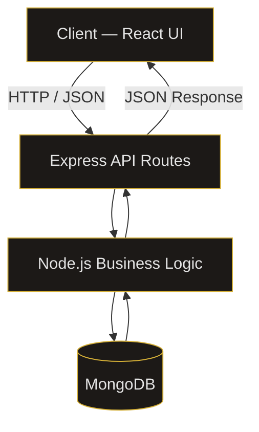
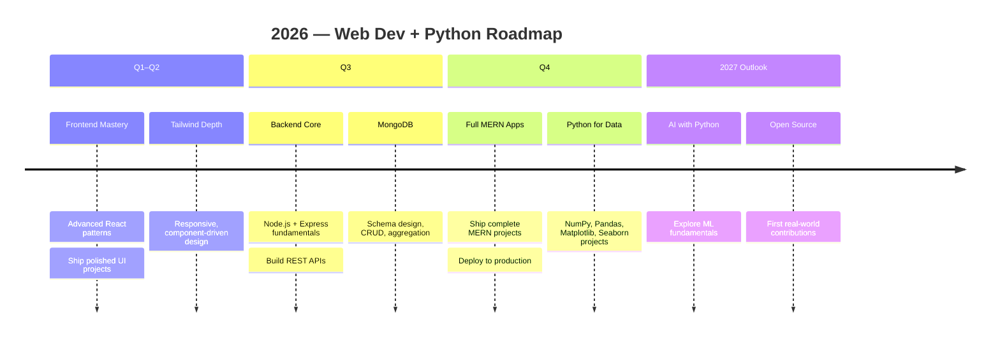
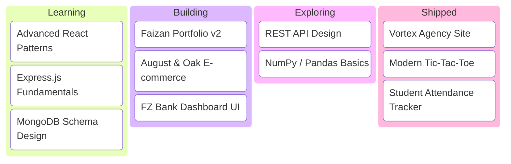
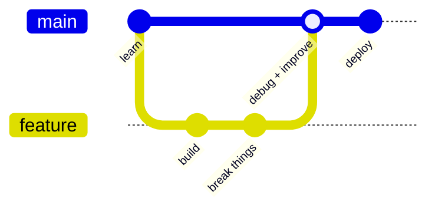
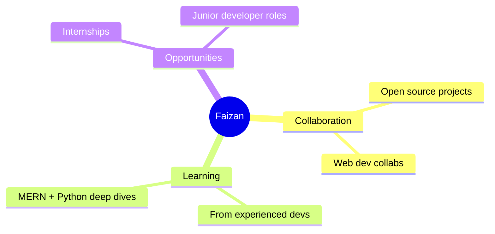

<div align="center">


<a href="https://github.com/Faizan-khan144"></a>
<a href="https://github.com/Faizan-khan144"></a>


<a href="https://www.linkedin.com/in/muhammadfaizankhan-76513041a/"></a>
<a href="https://x.com/faizan525nk"></a>
<a href="mailto:muhammadfaizankhan525@gmail.com"></a>


</div>

---

## About Me

```python
class MuhammadFaizanKhan:
    """Frontend Developer, transitioning into full-stack + data."""

    role        = "Frontend Developer"
    location    = "Pakistan"
    stack       = ["HTML", "CSS", "JavaScript", "React", "Tailwind CSS"]
    learning    = ["Node.js", "Express", "MongoDB", "MERN Stack"]
    exploring   = ["Python", "NumPy", "Pandas", "Matplotlib", "Seaborn"]
    available_for = ["Open source", "Internships", "Junior dev roles"]

    def philosophy(self) -> str:
        return "I don't just want to learn technologies — I want to build things with them."

    def __repr__(self) -> str:
        return f"<Developer role={self.role!r} status='building'>"


me = MuhammadFaizanKhan()
print(me.philosophy())
# → I don't just want to learn technologies — I want to build things with them.
```

*"Learn, build, debug, improve, repeat."*

---

## Tech Stack

<div align="center">

</div>

<table align="center">
<tr>
<td valign="top" width="20%">

**Frontend**
- HTML5
- CSS3
- JavaScript
- React
- Tailwind CSS

</td>
<td valign="top" width="20%">

**Backend**
- Node.js
- Express.js
- REST APIs

</td>
<td valign="top" width="20%">

**Database**
- MongoDB
- Local Storage

</td>
<td valign="top" width="20%">

**Python & Data**
- Python
- NumPy
- Pandas
- Matplotlib
- Seaborn

</td>
<td valign="top" width="20%">

**Dev Tools**
- Git, GitHub
- VS Code
- Postman
- Vercel

</td>
</tr>
</table>

---

## MERN Architecture — What I'm Building Toward



---

## 2026 Learning Roadmap



---

## Current Focus Board



---

## How I Work



---

## What I'm Open To



---

## Featured Projects

<table>
<tr>
<td width="50%">

**Faizan Portfolio**
Personal developer portfolio showcasing projects, skills, and journey.
`HTML` `CSS` `JavaScript`
[Repo](https://github.com/Faizan-khan144/faizan-portfolio) · [Live](https://faizan-khan144.github.io/faizan-portfolio/)

</td>
<td width="50%">

**August & Oak**
Modern e-commerce storefront — filtering, cart, wishlist, Local Storage.
`HTML` `CSS` `JavaScript`
[Repo](https://github.com/Faizan-khan144/august-and-oak-ecommerce)

</td>
</tr>
<tr>
<td width="50%">

**Vortex Agency**
Premium agency site — responsive sections, animation, modern UI.
`HTML` `CSS` `JavaScript`
[Repo](https://github.com/Faizan-khan144/vortex-agency)

</td>
<td width="50%">

**FZ Bank**
Banking interface with clean layouts and a dashboard experience.
`HTML` `CSS` `JavaScript`
[View](https://github.com/Faizan-khan144)

</td>
</tr>
</table>

---

## Experience

<table>
<tr>
<td width="100%">

**Frontend Developer** — *Freelance / Self-Directed Projects*
*2024 — Present*

Designing and building responsive, production-style web interfaces using HTML, CSS, JavaScript, React, and Tailwind CSS. Focused on clean component architecture, accessibility, and performance across multiple client-style projects, including e-commerce storefronts, agency websites, and dashboard interfaces.

- Built and shipped 4+ complete front-end projects, from wireframe to deployment
- Implemented cart, wishlist, and filtering logic using client-side state and Local Storage
- Currently extending skill set into the MERN stack (Node.js, Express, MongoDB) to deliver full-stack solutions
- Exploring Python for data analysis (NumPy, Pandas, Matplotlib, Seaborn) to broaden technical range

</td>
</tr>
</table>

**Core Competencies:** Responsive Web Design · Component-Based Architecture · REST API Integration · Version Control (Git/GitHub) · UI/UX Implementation · Cross-Browser Compatibility

**Currently Seeking:** Junior Frontend Developer roles · Internships · Open-source collaboration

---

## GitHub Analytics

<div align="center">


</div>

---

## Contribution Graph

<div align="center">

**Contribution snake** *(needs the included `snake.yml` workflow running once)*


**3D contribution profile** *(needs the included `3d-contrib.yml` workflow running once)*


**GitHub Skyline** — 3D-print your contribution history: [skyline.github.com](https://skyline.github.com/Faizan-khan144/2026)

**GitHub City** — drive through your contributions: [honzaap.github.io/GithubCity](https://honzaap.github.io/GithubCity?name=Faizan-khan144)

</div>

---

## Random Dev Quote

<div align="center">

</div>

---

## Guestbook

Drop a hello or say what you're building — opens a quick issue on this repo.

<div align="center">
<a href="https://github.com/Faizan-khan144/Faizan-khan144/issues/new?title=Hello!&body=Say%20hi%20or%20share%20what%20you're%20building!&labels=guestbook"></a>
<a href="https://github.com/Faizan-khan144/Faizan-khan144/issues?q=label%3Aguestbook"></a>
</div>

---

## Connect

<div align="center">

<a href="https://github.com/Faizan-khan144"></a>
<a href="https://www.linkedin.com/in/muhammadfaizankhan-76513041a/"></a>
<a href="https://x.com/faizan525nk"></a>
<a href="mailto:muhammadfaizankhan525@gmail.com"></a>

<br><br>


**Learn, build, debug, improve, repeat**

</div>
