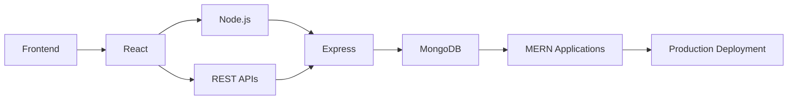

<div align="center">

# Muhammad Faizan Khan

### FRONTEND DEVELOPER

**JavaScript · React · Tailwind CSS · MERN**

Building responsive interfaces, experimenting with full-stack development, and turning ideas into real products.

<br/>

<a href="https://github.com/Faizan-khan144">

</a>
&nbsp;
<a href="https://github.com/Faizan-khan144">

</a>
&nbsp;


<br/><br/>

<a href="https://www.linkedin.com/in/muhammadfaizankhan-76513041/">

</a>
&nbsp;
<a href="https://x.com/faizan525nk">

</a>
&nbsp;
<a href="mailto:muhammadfaizankhan525@gmail.com">

</a>

<br/><br/>


</div>

---

## `01` — PROFILE

I'm a **Frontend Developer** focused on creating responsive and modern web experiences.

My primary focus is JavaScript and React, while I'm expanding into the **MERN stack** and exploring Python for data-oriented projects.

I enjoy taking an idea from a blank screen to a working product — designing the interface, writing the logic, debugging problems, and deploying the result.

```text
CURRENT DIRECTION

Frontend        ████████████████████  React / JavaScript
UI Engineering  ███████████████████░  Responsive Design
Backend         ████████████░░░░░░░░  Node / Express
Database        ██████████░░░░░░░░░░  MongoDB
Python          ███████████░░░░░░░░░  Data & Visualization
```

---

## `02` — TECHNOLOGY

### Frontend


### Backend & Database


### Python & Data


### Development Tools


---

## `03` — GITHUB · PAKISTAN

<div align="center">

### 🇵🇰 Pakistan Developer Rankings

<br/>


&nbsp;

&nbsp;


<br/><br/>

<sub>GitHub activity ranking based on the Committers ranking system.</sub>

</div>

---

## `04` — WHAT I BUILD

<table>
<tr>
<td width="50%" valign="top">

### Web Interfaces

Responsive websites with strong layouts, reusable components, clean typography, and modern interactions.

**Focus**

`React` `JavaScript` `Tailwind CSS`

</td>

<td width="50%" valign="top">

### Interactive Products

Applications with real functionality rather than static pages — filtering, state management, forms, dashboards, and client-side data handling.

**Focus**

`JavaScript` `React` `Local Storage`

</td>
</tr>

<tr>
<td width="50%" valign="top">

### Full-Stack Development

Currently expanding from frontend development into APIs, authentication, databases, and complete MERN applications.

**Focus**

`Node.js` `Express.js` `MongoDB`

</td>

<td width="50%" valign="top">

### Data & Python

Exploring Python libraries for data manipulation, analysis, and visualization.

**Focus**

`Python` `NumPy` `Pandas` `Matplotlib`

</td>
</tr>
</table>

---

## `05` — FEATURED PROJECTS

### AUGUST & OAK

**Modern E-commerce Experience**

A clean storefront with product filtering, cart functionality, wishlist interactions, and Local Storage.

`HTML` `CSS` `JavaScript`

→ [View Repository](https://github.com/Faizan-khan144/august-and-oak-ecommerce)

---

### VORTEX AGENCY

**Modern Agency Website**

A responsive agency experience focused on visual hierarchy, animations, polished sections, and modern frontend implementation.

`HTML` `CSS` `JavaScript`

→ [View Repository](https://github.com/Faizan-khan144/vortex-agency)

---

### FZ BANK

**Banking Dashboard Interface**

A modern banking UI concept focused on dashboard layouts, reusable sections, and responsive design.

`HTML` `CSS` `JavaScript`

→ [View GitHub](https://github.com/Faizan-khan144)

---

### FAIZAN PORTFOLIO

**Personal Developer Portfolio**

A portfolio website built to showcase projects, skills, experience, and development work.

`HTML` `CSS` `JavaScript`

→ [Repository](https://github.com/Faizan-khan144/faizan-portfolio)
→ [Live Website](https://faizan-khan144.github.io/faizan-portfolio/)

---

## `06` — DEVELOPMENT PATH



### Current Roadmap

```text
[✓] HTML / CSS
[✓] JavaScript
[✓] Responsive Web Design
[✓] Git / GitHub
[✓] React Fundamentals

[→] Advanced React
[→] Node.js
[→] Express.js
[→] MongoDB
[→] REST APIs

[ ] Full MERN Applications
[ ] Authentication
[ ] Advanced Backend Architecture
[ ] Open Source Contributions
```

---

## `07` — GITHUB ACTIVITY

<div align="center">


<br/><br/>


</div>

---

## `08` — CONTRIBUTIONS

<div align="center">


</div>

---

## `09` — EXPERIENCE

### Frontend Developer

**Freelance / Self-Directed Development**

Building frontend projects with a focus on responsive design, functionality, and maintainable code.

**What I work with:**

* Responsive website development
* React-based interfaces
* JavaScript functionality
* Component-driven UI
* E-commerce interfaces
* Dashboard experiences
* API integration
* Git/GitHub workflows

Currently expanding into full-stack development with the MERN ecosystem.

---

## `10` — CURRENT FOCUS

<table>
<tr>
<td align="center">

### FRONTEND

React
JavaScript
Tailwind CSS
UI Engineering

</td>

<td align="center">

### BACKEND

Node.js
Express.js
REST APIs
Authentication

</td>

<td align="center">

### DATA

Python
NumPy
Pandas
Visualization

</td>
</tr>
</table>

---

## `11` — DEVELOPMENT PHILOSOPHY

```text
Don't just learn the technology.

Understand it.
Build with it.
Break it.
Debug it.
Improve it.
Ship it.
```

---

## `12` — CONNECT

<div align="center">

If you're building something interesting, working on an open-source project, or looking for a frontend developer, feel free to reach out.

<br/>

<a href="https://github.com/Faizan-khan144">

</a>
<a href="https://www.linkedin.com/in/muhammadfaizankhan-76513041/">

</a>
<a href="https://x.com/faizan525nk">

</a>
<a href="mailto:muhammadfaizankhan525@gmail.com">

</a>

<br/><br/>

**BUILD · LEARN · SHIP**

</div>
