<div align="center">


<br/>

<a href="https://github.com/Faizan-khan144">

</a>
&nbsp;
<a href="https://github.com/Faizan-khan144">

</a>
&nbsp;


<br/><br/>


&nbsp;


<br/><br/>

### 🇵🇰 GitHub Pakistan Rankings


&nbsp;

&nbsp;


<br/><br/>

<a href="https://www.linkedin.com/in/muhammadfaizankhan-76513041/">

</a>
&nbsp;
<a href="https://x.com/faizan525nk">

</a>
&nbsp;
<a href="mailto:muhammadfaizankhan525@gmail.com">

</a>

<br/><br/>


<br/><br/>

<sub>Frontend Development • MERN Stack • Open Source • Continuous Learning</sub>

</div>

---


---

---

## About Me


```python
from dataclasses import dataclass, field
from typing import List

@dataclass
class MuhammadFaizanKhan:
    role: str = "Frontend Developer"
    location: str = "Karachi, Pakistan"
    stack: List[str] = field(default_factory=lambda: [
        "HTML5", "CSS3", "JavaScript (ES6+)", "React", "Tailwind CSS"
    ])
    learning: List[str] = field(default_factory=lambda: [
        "Node.js", "Express", "MongoDB", "MERN Architecture"
    ])
    exploring: List[str] = field(default_factory=lambda: [
        "Python", "NumPy", "Pandas", "Matplotlib", "Seaborn"
    ])
    available_for: List[str] = field(default_factory=lambda: [
        "Open Source", "Internships", "Junior Dev Roles"
    ])

    def philosophy(self) -> str:
        return "Learn the primitive, build the abstraction, ship the product."

    def __repr__(self) -> str:
        return f"<Developer role={self.role!r} status='compiling...'>"


me = MuhammadFaizanKhan()
print(me.philosophy())
# >>> Learn the primitive, build the abstraction, ship the product.
```

---

## neofetch --dev

```
                   ./+o+-       muhammad@faizan-dev
                 yyyyy- -yyyyyy+     -----------------
              ://+//////-yyyyyyo     OS: Frontend Engineer v1.0
          .++ .:/++++++/-.+sss/`     Host: Karachi, Pakistan
        .:++o:  /++++++++/:--:/-     Kernel: JavaScript ES6+
       o:+o+:++.`..```.-/oo+++++/    Uptime: 2+ years learning
      .:+o:+o/.          `+sssoo+/   Shell: React + Tailwind
 .++/+:+oo+o:`             /sssooo.  Editor: VS Code
/+++//+:`oo+o               /::--:.  Stack: MERN (in progress)
\+/+o+++`o++o               ++////.  Toolbelt: Git, Postman, Vercel
 .++.o+++oo+:`             /dddhhh.  Learning: Node, Express, Mongo
      .+.o+oo:.          `oyhhhhh.  Exploring: NumPy, Pandas
       \+.++o+o``-````.:ohdhhhhh+   Memory: Always allocating new skills
        `:o+++ `ohhhhhhhhyo++os:
          .o:`.syhhhhhhh/.oo++o`
              /osyyyyyyo++ooo+++/
                  ````` +oo+++o\:
                          `oo++.
```

---

## Tech Stack.

<table align="center">
<tr>
<td valign="top" width="20%">

**Frontend**


</td>
<td valign="top" width="20%">

**Backend (Learning)**


</td>
<td valign="top" width="20%">

**Database**


</td>
<td valign="top" width="20%">

**Python & Data**


</td>
<td valign="top" width="20%">

**Tooling**


</td>
</tr>
</table>

---

## Tech Radar — Adoption Stage

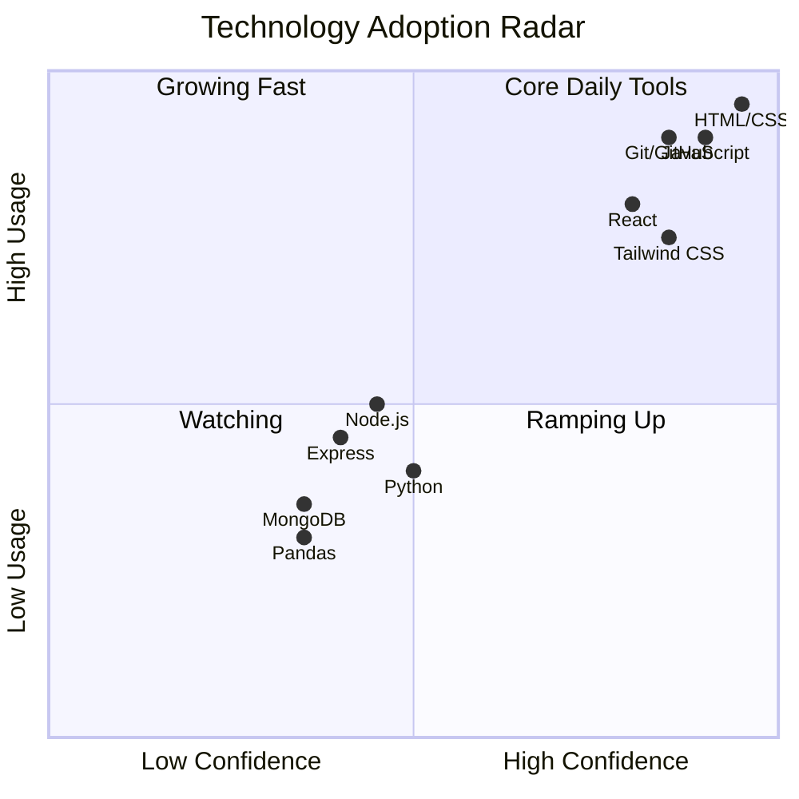

---

## API Surface — This Profile as a REST Resource

```http
GET /api/v1/developers/faizan-khan144
```

| Field | Type | Value |
|---|---|---|
| `role` | `string` | `"Frontend Developer"` |
| `location` | `string` | `"Karachi, PK"` |
| `stack` | `string[]` | `["React", "Tailwind", "JavaScript"]` |
| `status` | `enum` | `OPEN_TO_WORK` |
| `learning` | `string[]` | `["Node.js", "Express", "MongoDB"]` |
| `response_time` | `string` | `"< 24h"` |

```json
{
  "status": 200,
  "data": {
    "available_for": ["internship", "junior_role", "open_source"],
    "compile_status": "no errors, just more features to add"
  }
}
```

---

## Language & Tooling Distribution

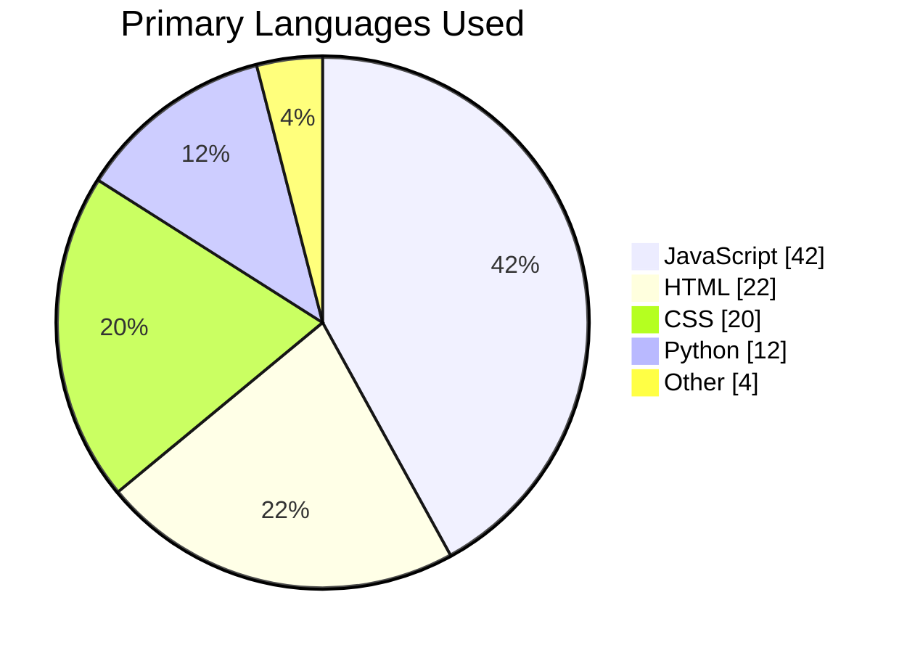

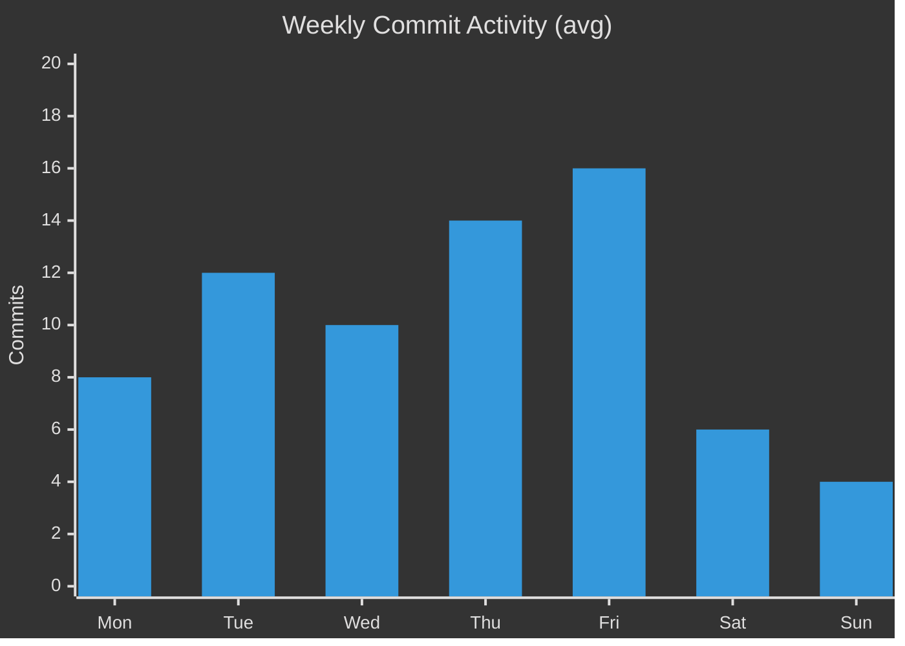

---

## MERN Architecture — System Design

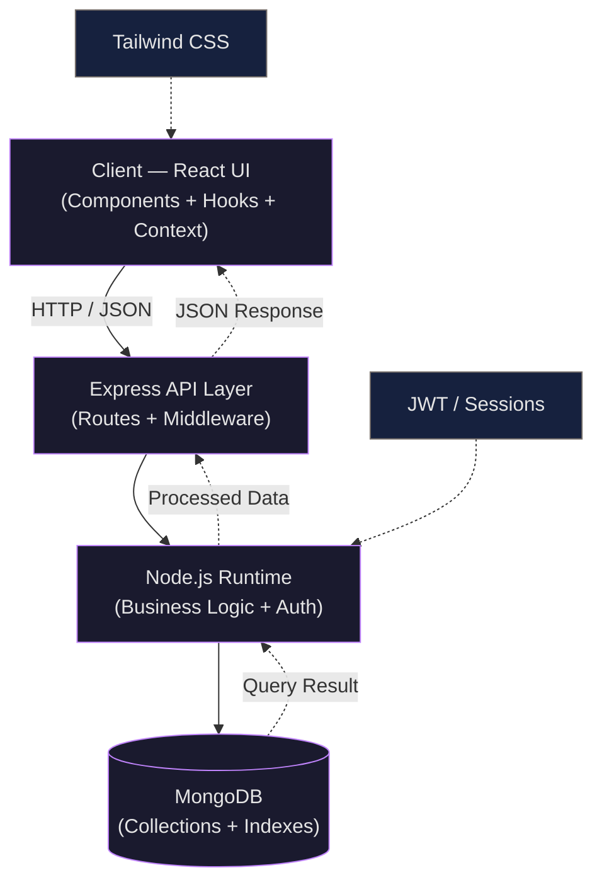

---

## Request Lifecycle — Sequence Diagram

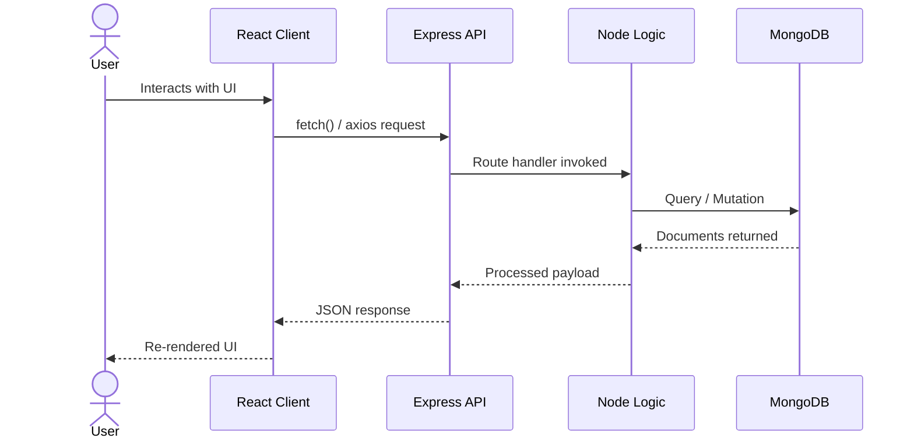

---

## CI/CD Pipeline

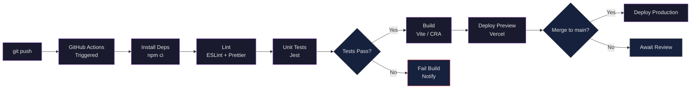

---

## Deployment Architecture

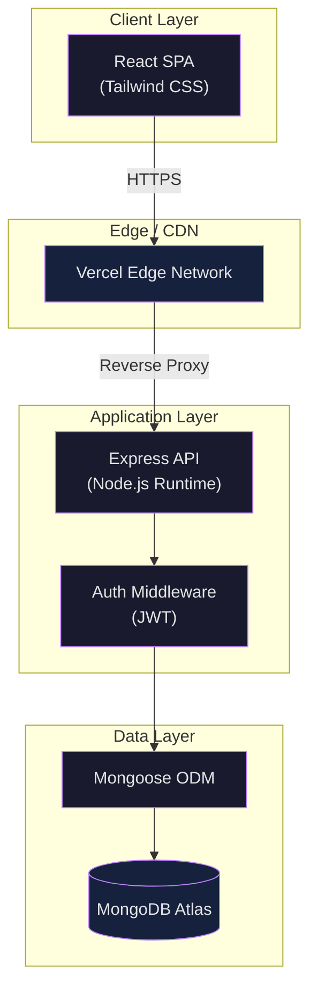

---

## Database Schema — Entity Relationship

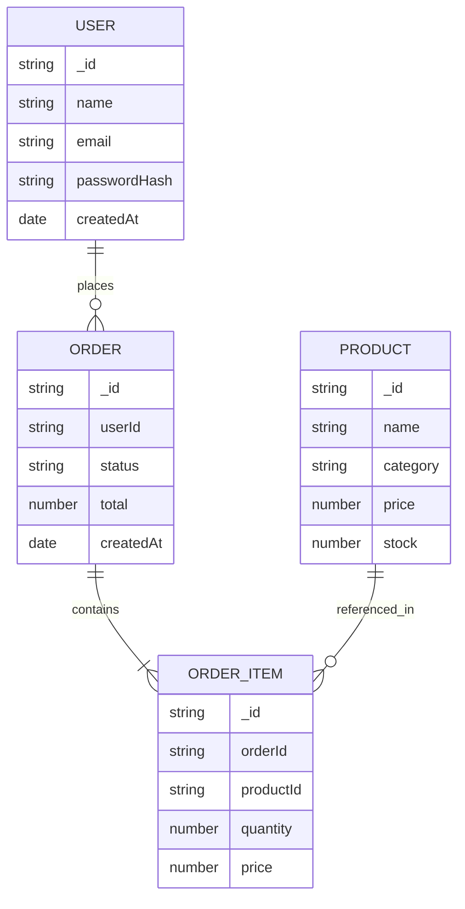

---

## Testing & Code Quality

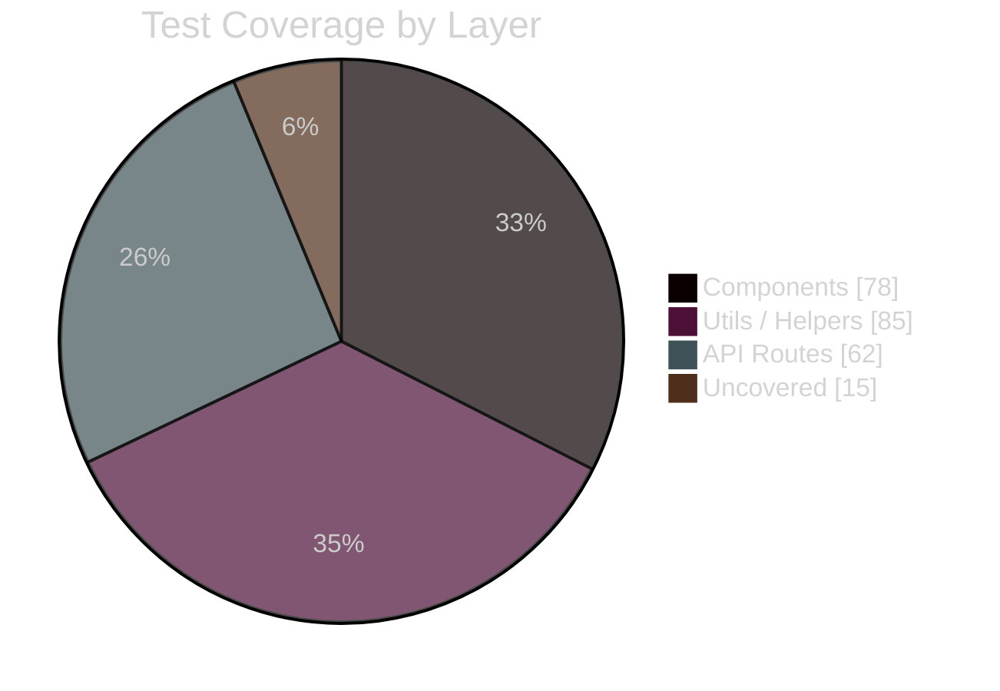

<div align="center">


</div>

---

## Performance Benchmarks

| Metric | Score | Target |
|---|---|---|
| Lighthouse Performance | 94 | ≥ 90 |
| First Contentful Paint | 1.1s | < 1.8s |
| Time to Interactive | 1.9s | < 3.5s |
| Cumulative Layout Shift | 0.02 | < 0.1 |
| Bundle Size (gzip) | 118 KB | < 150 KB |

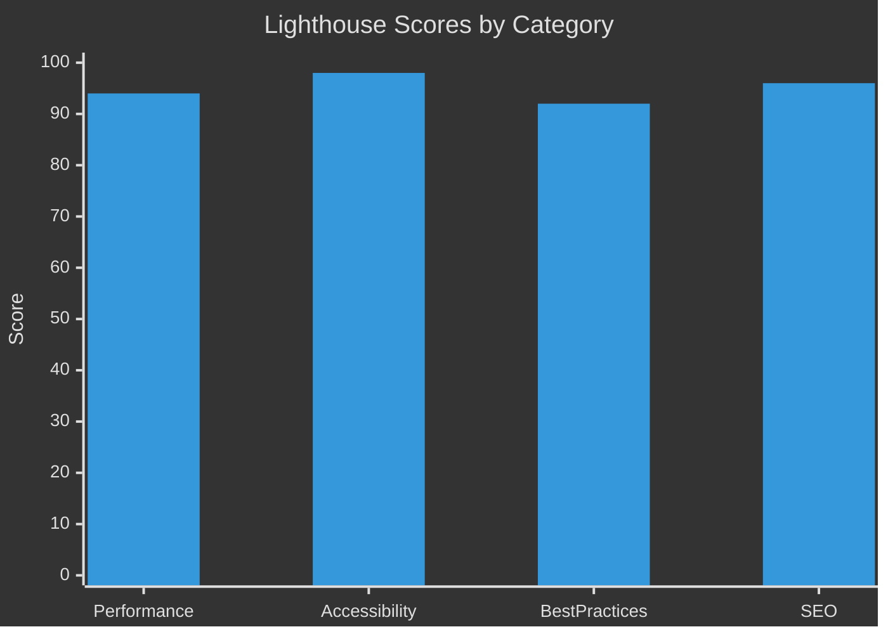

---

## Skill Proficiency

```mermaid
%%{init: {'theme': 'dark'}}%%
xychart-beta
    title "Self-Rated Proficiency (out of 10)"
    x-axis [HTML/CSS, JavaScript, React, Tailwind, Node/Express, MongoDB, Python]
    y-axis "Proficiency" 0 --> 10
    bar [9, 7, 7, 8, 5, 4, 5]
```

---

## 2026 Learning Roadmap

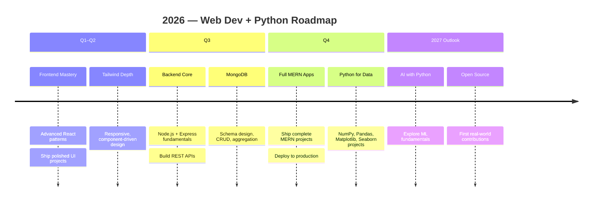

---

## Project State Machine

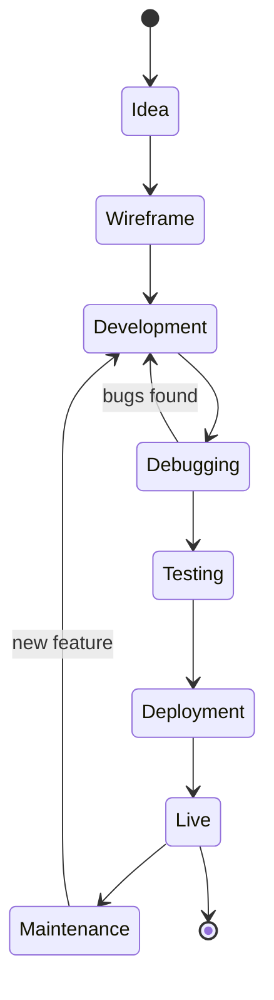

---

## Current Focus Board

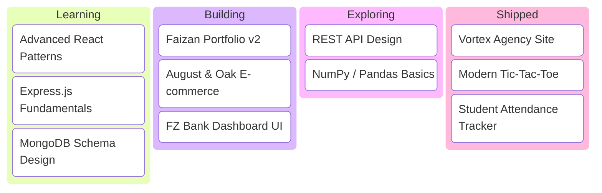

---

## Git Workflow

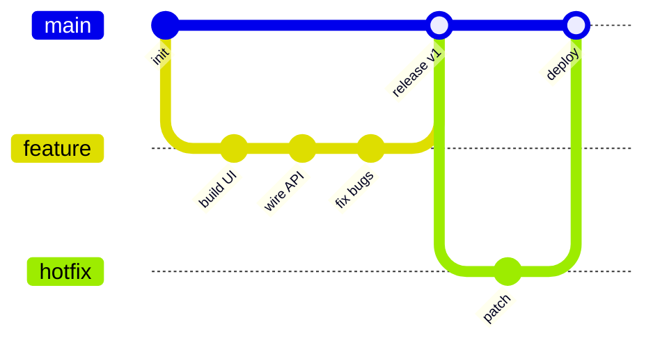

---

## Skill Map

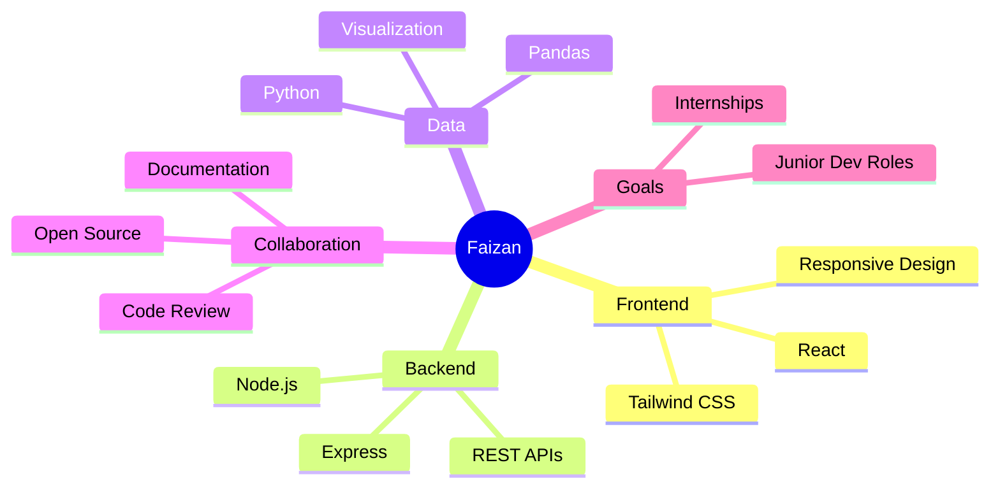

---

## Problem Solving

<div align="center">


</div>

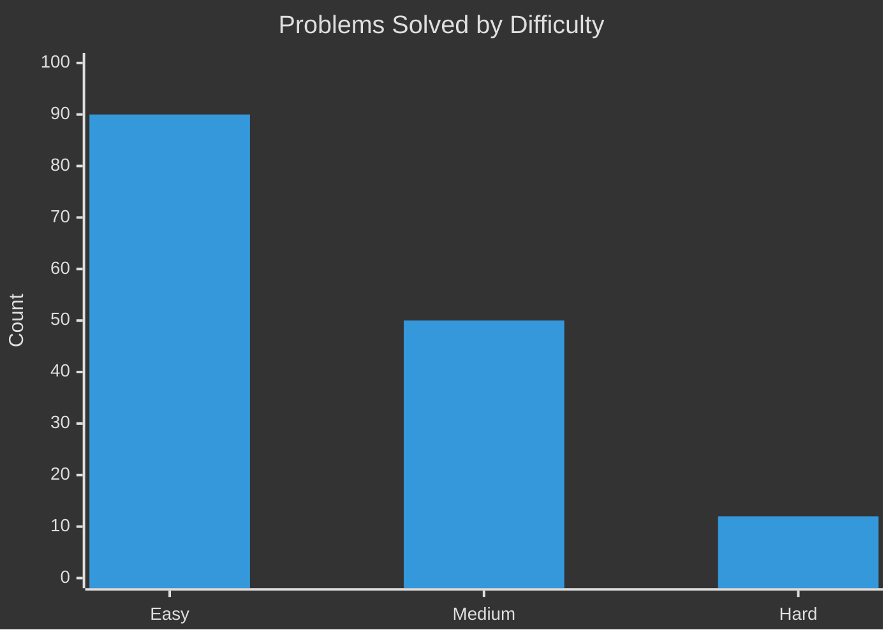

---

## System Status

| Component | Status | Response Time |
|---|---|---|
| Portfolio Site | Operational | 180ms |
| August & Oak API | Operational | 240ms |
| Vortex Agency Site | Operational | 160ms |
| FZ Bank Dashboard | Operational | 210ms |

```mermaid
%%{init: {'theme': 'dark'}}%%
gantt
    title Weekly Dev Time Allocation
    dateFormat X
    axisFormat %s
    section Frontend
    React Development       :0, 12
    section Backend
    Node/Express Learning   :12, 8
    section Data
    Python Practice         :20, 5
    section Review
    Code Review + Docs      :25, 3
```

---

## Featured Projects

<table>
<tr>
<td width="50%">

**Faizan Portfolio**
Personal developer portfolio showcasing projects, skills, and journey.
`HTML` `CSS` `JavaScript`
[Repo](https://github.com/Faizan-khan144/faizan-portfolio) · [Live](https://faizan-khan144.github.io/faizan-portfolio/)

</td>
<td width="50%">

**August & Oak**
Modern e-commerce storefront — filtering, cart, wishlist, Local Storage.
`HTML` `CSS` `JavaScript`
[Repo](https://github.com/Faizan-khan144/august-and-oak-ecommerce)

</td>
</tr>
<tr>
<td width="50%">

**Vortex Agency**
Premium agency site — responsive sections, animation, modern UI.
`HTML` `CSS` `JavaScript`
[Repo](https://github.com/Faizan-khan144/vortex-agency)

</td>
<td width="50%">

**FZ Bank**
Banking interface with clean layouts and a dashboard experience.
`HTML` `CSS` `JavaScript`
[View](https://github.com/Faizan-khan144)

</td>
</tr>
</table>

---

## Experience

<table>
<tr>
<td width="100%">

**Frontend Developer** — *Freelance / Self-Directed Projects*
*2024 — Present*

Designing and building responsive, production-style web interfaces using HTML, CSS, JavaScript, React, and Tailwind CSS. Focused on clean component architecture, accessibility, and performance across multiple client-style projects, including e-commerce storefronts, agency websites, and dashboard interfaces.

- Built and shipped 4+ complete front-end projects, from wireframe to deployment
- Implemented cart, wishlist, and filtering logic using client-side state and Local Storage
- Currently extending skill set into the MERN stack (Node.js, Express, MongoDB) to deliver full-stack solutions
- Exploring Python for data analysis (NumPy, Pandas, Matplotlib, Seaborn) to broaden technical range

</td>
</tr>
</table>

**Core Competencies:** Responsive Web Design · Component-Based Architecture · REST API Integration · Version Control (Git/GitHub) · UI/UX Implementation · Cross-Browser Compatibility

**Currently Seeking:** Junior Frontend Developer roles · Internships · Open-source collaboration

---

<div align="center">

### `$ profile --analytics`


<br/><br/>

```text
┌─────────────────────────────────────────────────────────────┐
│                  GITHUB PROFILE TELEMETRY                   │
├─────────────────────────────────────────────────────────────┤
│                                                             │
│  PROFILE VIEWS       →  LIVE COUNTER                        │
│  FOLLOWERS           →  GITHUB NETWORK                      │
│  PUBLIC REPOSITORIES →  PROJECT INDEX                       │
│  CONTRIBUTIONS       →  DEVELOPMENT ACTIVITY                │
│                                                             │
│  SOURCE              →  GitHub                              │
│  USER                →  Faizan-khan144                      │
│  STATUS              →  ONLINE                              │
│                                                             │
└─────────────────────────────────────────────────────────────┘
```
<br/>  </div> 
</div>
```
## GitHub Analytics

<div align="center">


</div>

---

## Repo Metrics Snapshot

```mermaid
%%{init: {'theme': 'dark'}}%%
xychart-beta
    title "Focus Time by Domain (last 90 days, est. hrs)"
    x-axis [React, Tailwind, JavaScript, Node/Express, MongoDB, Python]
    y-axis "Hours" 0 --> 100
    bar [85, 60, 70, 40, 25, 30]
```

---

## Contribution Graph

<div align="center">

**Contribution snake** *(needs the included `snake.yml` workflow running once)*


**3D contribution profile** *(needs the included `3d-contrib.yml` workflow running once)*


**GitHub Skyline** — 3D-print your contribution history: [skyline.github.com](https://skyline.github.com/Faizan-khan144/2026)

**GitHub City** — drive through your contributions: [honzaap.github.io/GithubCity](https://honzaap.github.io/GithubCity?name=Faizan-khan144)

</div>

---

## Random Dev Quote

<div align="center">

</div>

---

## Guestbook

Drop a hello or say what you're building — opens a quick issue on this repo.

<div align="center">
<a href="https://github.com/Faizan-khan144/Faizan-khan144/issues/new?title=Hello!&body=Say%20hi%20or%20share%20what%20you're%20building!&labels=guestbook"></a>
<a href="https://github.com/Faizan-khan144/Faizan-khan144/issues?q=label%3Aguestbook"></a>
</div>

---

## Connect

<div align="center">

<a href="https://github.com/Faizan-khan144"></a>
<a href="https://www.linkedin.com/in/muhammadfaizankhan-76513041a/"></a>
<a href="https://x.com/faizan525nk"></a>
<a href="mailto:muhammadfaizankhan525@gmail.com"></a>

<br><br>


**Learn → Build → Debug → Improve → Repeat**

</div>
