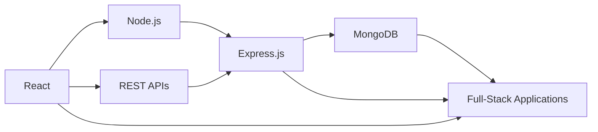
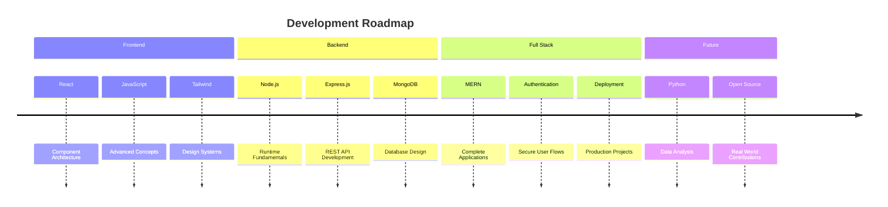

<div align="center">

# Muhammad Faizan Khan

### Frontend Developer · MERN Stack · JavaScript

Building responsive, modern web experiences with a focus on clean UI, practical functionality, and continuous improvement.

<br/>

<a href="https://github.com/Faizan-khan144">

</a>
<a href="https://github.com/Faizan-khan144">

</a>


<br/><br/>

<a href="https://www.linkedin.com/in/muhammadfaizankhan-76513041/">

</a>
<a href="https://x.com/faizan525nk">

</a>
<a href="mailto:muhammadfaizankhan525@gmail.com">

</a>

<br/><br/>


</div>

---

## About Me

```python
class Developer:
    name = "Muhammad Faizan Khan"
    role = "Frontend Developer"
    location = "Karachi, Pakistan"

    stack = [
        "HTML5",
        "CSS3",
        "JavaScript",
        "React",
        "Tailwind CSS"
    ]

    learning = [
        "Node.js",
        "Express.js",
        "MongoDB",
        "MERN Stack"
    ]

    exploring = [
        "Python",
        "NumPy",
        "Pandas",
        "Matplotlib",
        "Seaborn"
    ]

    focus = [
        "Responsive Interfaces",
        "Modern UI",
        "Frontend Architecture",
        "Full-Stack Development"
    ]

    philosophy = "Learn → Build → Debug → Improve → Repeat"
```

I'm a frontend developer focused on building **responsive, accessible, and production-style web interfaces**.

My current work revolves around JavaScript and React while expanding into backend development with Node.js, Express, and MongoDB.

I enjoy turning ideas into functional products, experimenting with new technologies, and improving projects through iteration.

---

## Tech Stack

### Frontend

<p>


</p>

### Backend & Database

<p>


</p>

### Python & Data

<p>


</p>

### Tools

<p>


</p>

---

## 🇵🇰 GitHub Pakistan Rankings

<div align="center">


&nbsp;

&nbsp;


</div>

---

## Development Workflow

```text
Idea
  ↓
Plan
  ↓
Design
  ↓
Build
  ↓
Debug
  ↓
Test
  ↓
Deploy
  ↓
Improve
```

I focus on building projects that are not only visually polished but also structured around maintainable code and practical functionality.

---

## Featured Projects

<table>
<tr>
<td width="50%">

### Faizan Portfolio

Personal developer portfolio showcasing projects, skills, experience, and development journey.

**Stack:** HTML · CSS · JavaScript

<a href="https://github.com/Faizan-khan144/faizan-portfolio">Repository</a> · <a href="https://faizan-khan144.github.io/faizan-portfolio/">Live Demo</a>

</td>

<td width="50%">

### August & Oak

Modern e-commerce storefront featuring product filtering, cart functionality, wishlist interactions, and Local Storage.

**Stack:** HTML · CSS · JavaScript

<a href="https://github.com/Faizan-khan144/august-and-oak-ecommerce">Repository</a>

</td>
</tr>

<tr>
<td width="50%">

### Vortex Agency

Modern agency website focused on responsive layouts, visual hierarchy, animations, and polished UI.

**Stack:** HTML · CSS · JavaScript

<a href="https://github.com/Faizan-khan144/vortex-agency">Repository</a>

</td>

<td width="50%">

### FZ Bank

Modern banking interface focused on dashboard layouts, reusable UI sections, and responsive design.

**Stack:** HTML · CSS · JavaScript

<a href="https://github.com/Faizan-khan144">GitHub Profile</a>

</td>
</tr>
</table>

---

## MERN Journey



### Current Direction

```text
Frontend
├── React
├── Component Architecture
├── Responsive Design
└── UI Development

Backend
├── Node.js
├── Express.js
├── REST APIs
└── Authentication

Database
├── MongoDB
├── Mongoose
└── Data Modeling

Next
├── Full MERN Applications
├── Production Deployment
└── Open Source Contributions
```

---

## GitHub Analytics

<div align="center">


<br/><br/>


<br/><br/>


</div>

---

## Contribution Graph

<div align="center">


</div>

---

## Experience

### Frontend Developer

**Freelance / Self-Directed Projects · 2024 — Present**

Building responsive web experiences and client-style projects using modern frontend technologies.

* Developed responsive websites from concept through deployment
* Built interactive interfaces using JavaScript and React
* Implemented e-commerce functionality including filtering, cart, wishlist, and Local Storage
* Focused on reusable components and maintainable frontend structure
* Expanding into Node.js, Express.js, and MongoDB
* Exploring Python for data analysis and visualization

---

## Current Focus

<div align="center">

| Area     | Focus                             |
| -------- | --------------------------------- |
| Frontend | React · JavaScript · Tailwind CSS |
| Backend  | Node.js · Express.js · REST APIs  |
| Database | MongoDB · Mongoose                |
| Data     | Python · NumPy · Pandas           |
| Tools    | Git · GitHub · Postman · Vercel   |
| Goal     | Full-Stack MERN Development       |

</div>

---

## Learning Roadmap



---

## Open Source

I'm interested in contributing to projects involving:

* Frontend development
* React
* JavaScript
* UI/UX implementation
* Documentation
* Beginner-friendly open-source issues

---

## Let's Connect

<div align="center">

<a href="https://github.com/Faizan-khan144">

</a>

<a href="https://www.linkedin.com/in/muhammadfaizankhan-76513041/">

</a>

<a href="https://x.com/faizan525nk">

</a>

<a href="mailto:muhammadfaizankhan525@gmail.com">

</a>

<br/><br/>

**Learn → Build → Debug → Improve → Repeat**

</div>
