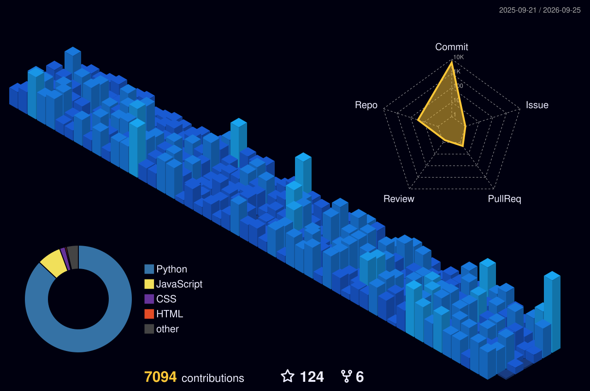
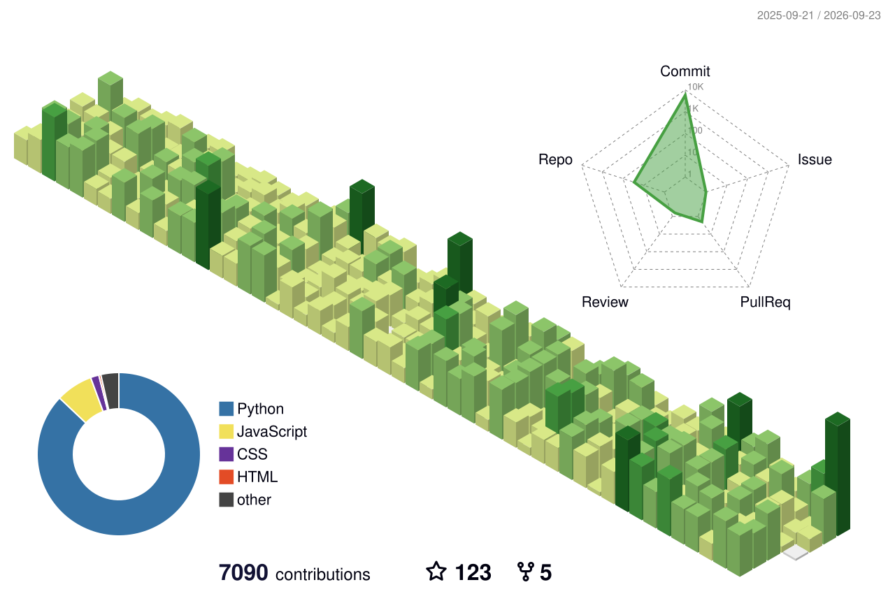
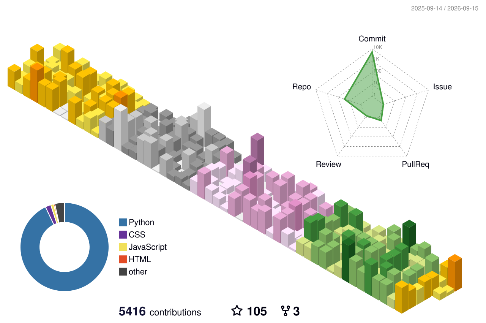
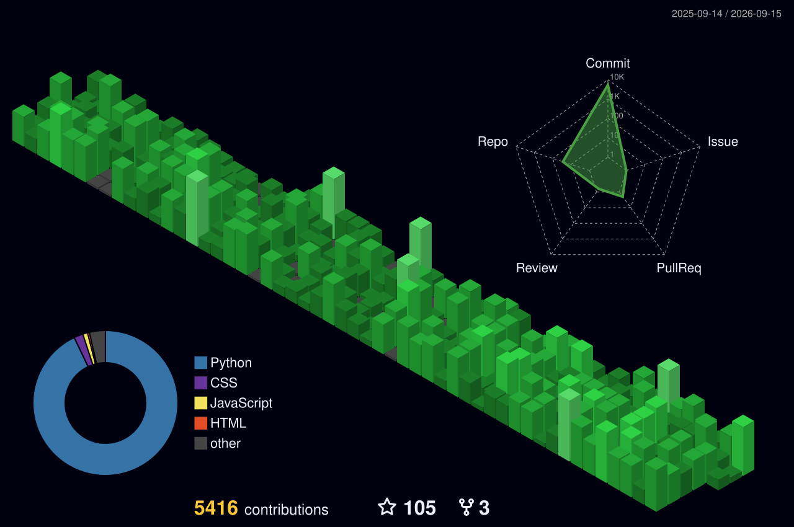
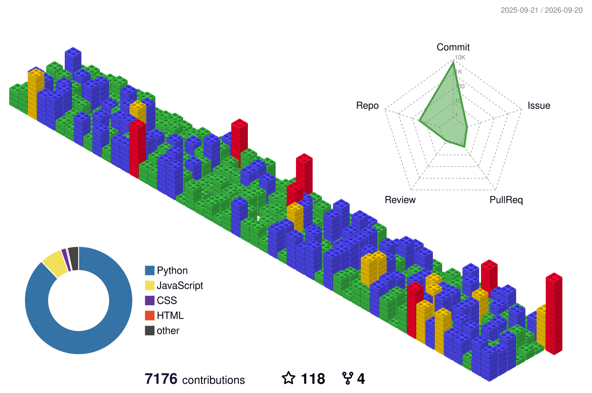

````md
<div align="center">


<br>


<br><br>

<a href="https://faizan-khan144.github.io/faizan-portfolio/">

</a>

<a href="https://www.linkedin.com/in/muhammad-faizan-khan-76513041/">

</a>

<a href="https://github.com/Faizan-khan144">

</a>

<a href="https://x.com/faizan525nk">

</a>

<a href="https://www.instagram.com/muhammadfaizankhan324/reels/">

</a>

<br><br>


</div>

---

<div align="center">

```text
╔══════════════════════════════════════════════════════════════════════╗
║                         SYSTEM ONLINE                               ║
╠══════════════════════════════════════════════════════════════════════╣
║                                                                      ║
║  USER       : MUHAMMAD FAIZAN KHAN                                  ║
║  ROLE       : FRONTEND DEVELOPER                                    ║
║  SPECIALTY  : REACT / MODERN WEB / MERN                             ║
║  EXPLORING  : AI WITH PYTHON                                        ║
║  STATUS     : BUILDING                                              ║
║  MINDSET    : LEARN → BUILD → BREAK → FIX → SHIP                    ║
║                                                                      ║
╚══════════════════════════════════════════════════════════════════════╝
````

</div>

# `01 / ABOUT`

```js
const developer = {
  name: "Muhammad Faizan Khan",
  role: "Frontend Developer",

  specialties: [
    "Frontend Development",
    "React",
    "Responsive UI",
    "Modern Web Experiences"
  ],

  learning: [
    "MERN Stack",
    "Backend Development",
    "AI with Python"
  ],

  philosophy: "Learn. Build. Improve. Ship."
};
```

I build modern, responsive interfaces and turn ideas into working products.

I'm focused on **frontend development and React**, while continuously expanding into the **MERN stack and AI with Python**.

---

# `02 / TECH STACK`

<div align="center">

### FRONTEND


<br><br>

### BACKEND


<br><br>

### AI / PYTHON


<br><br>

### DEVELOPMENT TOOLS


</div>

---

# `03 / DEVELOPER ARCHITECTURE`

```text
                           ┌─────────────────────┐
                           │       FAIZAN        │
                           │      DEVELOPER      │
                           └──────────┬──────────┘
                                      │
              ┌───────────────────────┼───────────────────────┐
              │                       │                       │
              ▼                       ▼                       ▼
        ┌───────────┐           ┌───────────┐           ┌───────────┐
        │ FRONTEND  │           │  BACKEND  │           │    AI     │
        └─────┬─────┘           └─────┬─────┘           └─────┬─────┘
              │                       │                       │
        ┌─────┼─────┐           ┌─────┼─────┐           ┌─────┴─────┐
        │     │     │           │     │     │           │           │
       HTML  CSS   JS          Node  Express Mongo    Python       ML
              │
              ▼
            React
              │
              ▼
         Tailwind CSS
```

---

# `04 / CURRENT MISSION`

<div align="center">

```text
╔════════════════════════════════════════════════════════════╗
║                     CURRENT MISSION                       ║
╠════════════════════════════════════════════════════════════╣
║                                                            ║
║  [01] BUILD                                               ║
║       ├─ Modern React applications                        ║
║       ├─ Responsive interfaces                            ║
║       ├─ Developer tools                                  ║
║       └─ Real-world products                              ║
║                                                            ║
║  [02] LEARN                                               ║
║       ├─ MERN Stack                                       ║
║       ├─ Backend Development                              ║
║       ├─ Artificial Intelligence                          ║
║       └─ Python                                           ║
║                                                            ║
║  [03] IMPROVE                                             ║
║       ├─ UI / UX                                          ║
║       ├─ Architecture                                     ║
║       ├─ Problem Solving                                  ║
║       └─ Product Development                              ║
║                                                            ║
╚════════════════════════════════════════════════════════════╝
```

</div>

---

# `05 / FEATURED PROJECTS`

<div align="center">

<a href="https://github.com/Faizan-khan144/devdock">

</a>

<a href="https://github.com/Faizan-khan144/aplinode-clone">

</a>

</div>

---

# `06 / GITHUB PERFORMANCE`

<div align="center">


<br><br>


</div>

---

# `07 / ACTIVITY MATRIX`

<div align="center">


</div>

---

# `08 / 3D CONTRIBUTION MATRIX`

<div align="center">


<br><br>



</div>

---

# `09 / 3D CONTRIBUTION MODES`

<div align="center">





<br><br>





</div>

---

# `10 / GITHUB TROPHIES`

<div align="center">


</div>

---

# `11 / DEVELOPMENT PIPELINE`

<div align="center">

```text
       ┌─────────────┐
       │     IDEA    │
       └──────┬──────┘
              │
              ▼
       ┌─────────────┐
       │   DESIGN    │
       └──────┬──────┘
              │
              ▼
       ┌─────────────┐
       │    CODE     │
       └──────┬──────┘
              │
              ▼
       ┌─────────────┐
       │   DEBUG     │
       └──────┬──────┘
              │
              ▼
       ┌─────────────┐
       │    TEST     │
       └──────┬──────┘
              │
              ▼
       ┌─────────────┐
       │    SHIP     │
       └──────┬──────┘
              │
              ▼
       ┌─────────────┐
       │   REPEAT    │
       └─────────────┘
```

</div>

---

# `12 / TERMINAL`

```text
┌──(faizan㉿github)-[~/development]
│
├── $ whoami
│   muhammad-faizan-khan
│
├── $ role
│   frontend-developer
│
├── $ stack
│   react • javascript • tailwind • node • express • mongodb
│
├── $ learning
│   mern • python • artificial-intelligence
│
├── $ status
│   building...
│
└── $ _
```

---

# `13 / DEVELOPER MINDSET`

<div align="center">

```text
             ┌──────────┐
             │  LEARN   │
             └────┬─────┘
                  │
                  ▼
             ┌──────────┐
             │  BUILD   │
             └────┬─────┘
                  │
                  ▼
             ┌──────────┐
             │  BREAK   │
             └────┬─────┘
                  │
                  ▼
             ┌──────────┐
             │  DEBUG   │
             └────┬─────┘
                  │
                  ▼
             ┌──────────┐
             │ IMPROVE  │
             └────┬─────┘
                  │
                  ▼
             ┌──────────┐
             │   SHIP   │
             └────┬─────┘
                  │
                  └───────────────► REPEAT
```

### `Don't just learn technology. Build with it.`

</div>

---

# `14 / CONNECT`

<div align="center">

<a href="https://faizan-khan144.github.io/faizan-portfolio/">

</a>

<a href="https://www.linkedin.com/in/muhammad-faizan-khan-76513041/">

</a>

<a href="https://github.com/Faizan-khan144">

</a>

<a href="https://x.com/faizan525nk">

</a>

<a href="https://www.instagram.com/muhammadfaizankhan324/reels/">

</a>

</div>

---

<div align="center">

```text
╔════════════════════════════════════════════════════════════╗
║                                                            ║
║              BUILDING. LEARNING. SHIPPING.                ║
║                                                            ║
║                    SYSTEM STATUS: ON                      ║
║                                                            ║
╚════════════════════════════════════════════════════════════╝
```

<br>


</div>
```

**One important thing:** because your 3D workflow is now working, don't manually upload those SVGs. Let the Action generate/update them. Then commit the generated `profile-3d-contrib` folder if the Action doesn't automatically commit it to your repository.
